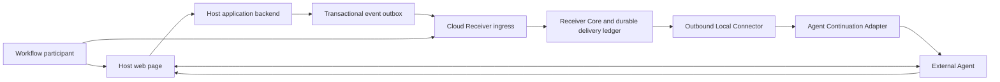

# Re-entry Core — System Architecture

**Role:** CANONICAL system-wide architecture overview  
**Status:** Application-neutral Core and target topology remain current; `runtime/cloud-receiver/` is
deprecated historical evidence; ADR-0044 permits active `saas-boilerplate/` v2 to remain an
independent Receiver only behind pinned conformance, whose active-v2 proof remains open; Sleepless
Kingdom is the selected Host application, while production profiles and a concrete Agent runtime
remain open  
**Authority:** ADR-0006 through ADR-0015, historical ADR-0019 through ADR-0032, and active v2
ADR-0033 through ADR-0045

## Selected-product target and retained implementation profiles

[ADR-0046](../Decisions/ADR-0046-restore-bound-task-notification-continuation.md) restores the bound-existing-task, notification-only target. Receiver custody
ends at account/device authority and notification delivery; the local Adapter privately persists
approved-Grant-to-selected-task binding. Receiver settlement must not wait for Agent work or a
Host effect. The lifecycle below is the accepted target, not an implemented route. Existing
v0.1/v0.2 source, HTTP, data, and effect-ACK descriptions remain exact compatibility profiles;
TASK-029 owns an explicit transition, TASK-035 the missing binding, and TASK-034 runtime proof.

## 1. Objective

Define one application-neutral architecture that lets a Host website issue bounded future
continuation authority without giving the Host, Receiver, Connector, or Agent more authority than
its role requires.

This document owns topology, component responsibility, system lifecycle, and integration seams.
Detailed module contracts belong to [Docs/Mechanisms](../Mechanisms/README.md). Exact durable
choices belong to ADRs; current evidence belongs to Core/00 and Core/05.

## 2. Architectural invariants

1. Host business truth and Receiver continuation authority are separate.
2. Manifest enrollment and later event acceptance are separate operations.
3. Viewing an offer creates no Grant.
4. The Host receives an opaque binding, never a raw Grant or Agent-context locator.
5. The event carries bounded typed transition data, not a prompt, artifact, or tool plan.
6. Accepted event, pending delivery, activation attempt, Host effect, and acknowledgement are
   separate states.
7. Re-entry has one normative Receiver authority model; every retained executable Receiver must pass
   the same pinned versioned black-box conformance contract.
8. The Local Connector is outbound-only and cannot issue or reinterpret authority.
9. Context selection occurs only inside the selected Agent Adapter's private boundary.
10. Re-entry returns to the canonical page and revalidates current state and tools.
11. Human and Agent interfaces share backend authorization and state rules.
12. Unsupported capability fails visibly; no hidden fallback exists.
13. Protocol-v0.2 standing authority persists across signals, but each signal reserves only one
    bounded activation and the initial profile permits at most one non-terminal activation per
    Grant.

ADR-0044 amends only ADR-0006's implementation-identity rule. The Core/SQLite path remains the
reference and conformance owner; the active TypeScript/Prisma/PostgreSQL Receiver may remain
independent. **VERIFICATION PENDING:** both implementations have not yet passed the same pinned
v0.1/v0.2 suite through real transport and durable stores, so architecture acceptance is not active-
Receiver equivalence or deployment evidence.

## 3. Component topology



| Component | Owns | Does not own |
|---|---|---|
| Host web page | Human UI, current-state presentation, genuine state-derived Site Tools, re-entry explanation | Receiver or Agent credentials |
| Host backend | Workflow state, authorization, artifact revisions, business transitions, event outbox, issuer key | Consent, delivery, or Agent activation |
| Cloud Receiver shell or conforming implementation | Authenticated ingress, service identity, durable work availability, exact protocol-profile dispatch | Alternate normative semantics or device control |
| Receiver Core | Challenge, Grant, event, replay, reservation, delivery, revocation, acknowledgement rules | Host mutation or Agent execution |
| Durable delivery ledger | Pending, lease, attempt, effect, acknowledgement, expiry, terminal projection | Business-event truth or Agent instruction |
| Local Connector | Account-linked target retrieval, lease handoff, adapter dispatch, acknowledgement request | Grant issuance, event interpretation, public inbound control |
| Agent Adapter | Private context resolution and one bounded activation attempt | Event acceptance, Host effect, delivery acknowledgement |
| Agent runtime | Managed context, Browser capability, navigation, Site Tool invocation | Receiver authority or human consequence |

## 4. End-to-end lifecycle

### Phase A — Enrollment

1. The Host backend signs one bounded Manifest for the current workflow state.
2. The live page exposes the Manifest through genuine WebMCP.
3. The Receiver verifies the trusted page origin and issuer.
4. The Receiver creates a challenge with no Grant.
5. A Receiver-owned authenticated human decision selects an eligible account-linked device and may
   create one private Grant, one public Host binding, and one private receipt.
6. A trusted local enrollment step associates that approved Grant with the user's explicitly
   selected existing task and persists the private binding. This missing TASK-035 integration must
   handle partial enrollment visibly; device pairing alone never proves task binding.

### Phase B — Waiting

1. The page or Agent turn may end.
2. The Host retains only the opaque binding.
3. The Receiver retains effective Grant and delivery authority.
4. No Agent work exists until a matching event is accepted.

### Phase C — Authoritative transition

1. The Host commits its business transition and event intent atomically.
2. The outbox delivers the same signed typed event at least once.
3. Receiver Core verifies the event against the private live Grant.
4. One transaction records Event truth and creates one pending Delivery. Protocol v0.1 consumes the
   one-run Grant; protocol v0.2 reserves the standing Grant's single active slot without consuming
   the Grant.
5. Event acceptance performs no Agent call.

### Phase D — Delivery and activation

1. An authenticated eligible Connector claims one short lease.
2. The Connector derives a credential-free activation.
3. The selected Adapter resolves the private managed-context binding.
4. One driver call attempts activation and returns one bounded result.
5. Settle notification delivery only at the specified trusted handoff boundary, independently of
   Agent business execution. TASK-029 must define and implement this boundary; a generic adapter
   result or process exit is not sufficient, and existing effect-ACK routes remain unchanged.

### Phase E — Re-entry and completion

1. The Agent opens the allowlisted canonical Host URL.
2. The Host revalidates identity, permission, workflow state, state version, and artifact revision.
3. The page registers only the Site Tools valid for current state.
4. The same task uses the user's prior strategy and current state to choose a permitted action,
   no command, or required human clarification. An Event is not a mandatory action instruction.
5. The Agent stops before the selected human consequence.
6. Any Game mutation has independent Host evidence, but the Receiver neither waits for it nor
   monitors Agent completion. Interruption or no action is not grounds to resend the notification.
7. Subsequent eligible notifications reuse the same standing Consent and private task binding.
   Notification capacity and task busy scheduling are separate; exact settlement and coalescing
   rules remain TASK-029/TASK-034 gates, not a wait for business completion.

## 5. Integration contracts

| Contract | Project owner | Integrator obligation | Current status |
|---|---|---|---|
| Host backend to Receiver | Re-entry protocol and Host SDK | issuer identity, signed Manifest/event, outbox, canonical workflow | application-neutral kernel locally verified |
| Receiver to Connector | Receiver Core and transport contract | target identity, outbound claim, lease, trusted notification settlement for selected product | retained effect-backed profiles locally verified; notification transition open under TASK-029 |
| Connector to Agent runtime | Agent Adapter and binding contract | private binding custody, activation, Browser and WebMCP evidence | deterministic contract verified; concrete runtime open |
| Agent to Host page | Sleepless Kingdom under `WebApp/Web-Game/` | canonical shelter page, current authority, dynamic reads/recall, persistent mission decision, human boundary | selected; bounded local Game evidence exists, external Agent return remains open |

These contracts are versioned and verified separately. Conformance on one does not prove the next.

## 6. Deployment profiles

### Target production profile

```text
Sleepless Kingdom Host application and backend
-> hosted Cloud Receiver shell
-> conforming Receiver authority implementation and durable store
-> paired outbound Local Connector
-> selected Agent Adapter and runtime
```

This is the selected reference topology, not a deployed result.

### Local development profile

`runtime/cloud-receiver/` historically ran the same Receiver Core behind a loopback-only service
shell with file-backed SQLite, bounded operational routes, graceful shutdown, account-linked device
authorization, Host-key registration, and Re-entry-owned consent. It is deprecated under ADR-0032;
its source is retained for evidence only. `runtime/local-connector/` is one
separate outbound-only Node process that stores its delivery credential locally, performs bounded
background polling and explicit claim/adapter handoff, can run under a generated per-user macOS
LaunchAgent, and can contain the opt-in local Codex fresh-session adapter. A trusted composition must
supply the authority ports; the local preview leaves production consent identity, Grant control,
Host-effect verification, and supported Agent activation visibly unsupported.
Deterministic authorities remain test-only. This profile exists for development and evidence; it is
not an automatic shipping fallback or public deployment profile.

### Active v2 preview profile

`saas-boilerplate/` contains a separate Next.js frontend and Express/Prisma/PostgreSQL Receiver.
It implements the ADR-0033 through ADR-0041 pairing, consent, Event, delivery, acknowledgement,
transport, disconnect, and developer-control increments. Local aggregate, browser-persona, and
separate-process evidence exists, and bounded preview deployments are recorded. ADR-0044 permits
this independent implementation only behind pinned shared conformance. CLOUD-023 records the
working-tree standing kernel's 154-test backend aggregate, additive disposable-PostgreSQL migration,
and shared Express two-signal trace. These use internal Consent/control seams and deterministic
effect authority; pinned conformance, committed-source migration verification, public controls, and
release enforcement remain open. This is not a production service or a supported
Agent-to-Browser/WebMCP join.

### Alternative hosted-Agent profile

A hosted Agent may replace the Local Connector path only through a later ADR proving compatible
Browser, genuine page-bound WebMCP, authority, context, and evidence behavior. It cannot silently
replace the selected topology.

## 7. Selected application boundary

ADR-0042 selects Sleepless Kingdom. Its scoped product layer must implement:

- one durable workflow and canonical page;
- one asynchronous later event;
- one persistent artifact or decision;
- initial and resumed state models;
- normal human UI and genuine WebMCP tools;
- backend authorization, stale-state, and revision controls;
- one human consequence boundary;
- event outbox and issuer-key custody; and
- deterministic synthetic reset and judge path.

The application specializes the Host-facing module. It does not fork Receiver Core or place domain
business rules in the Connector.

## 8. Current as-built boundary

`reentry-core/` implements the first four application-neutral mechanism contracts, the frozen v0.1
process profile, and the shared standing-v0.2 expected-state scenario. Local tests cover protocol,
Receiver authority, durable reference state, delivery, exact v0.1/v0.2 HTTP mapping, versioned
outbound client, deterministic adapter, two-signal standing cross-layer flow, private binding
resolution, and bounded process-fault compositions.

`runtime/cloud-receiver/` implemented the ADR-0019 Stage 1 listener, operational readiness, native relational
hosted persistence with one-time snapshot backfill under ADR-0031, durable composition, process lifecycle,
historical ADR-0020 pairing control plane, ADR-0021 Host-key
registration, historical ADR-0022 consent handoff, ADR-0028 account authorization, and current
ADR-0030 dashboard-issued pairing around those unchanged contracts. It is now deprecated by ADR-0032;
its source and tests are historical evidence only. `runtime/local-connector/`
implements the dashboard pairing-ID/code client, restrictive local credential store, bounded background claim/adapter
handoff, generated macOS user service, and an opt-in local Codex fresh-session adapter. Tests cover
account and device approval, credential reuse, Host-key registration, consent approval and decline,
target selection, controlled store reopen, Connector identity resolution, credential-file
permissions, credential-free adapter input, bounded polling, graceful stop, the generic Core flow,
and signal-driven process closure.

`saas-boilerplate/` is the active v2 Receiver implementation. Its backend owns separate user and
developer accounts, pairing and Connector rows, organizations and API keys, Host keys, Consent
sessions, subject bindings, Grants, Events, Deliveries, and Delivery Attempts in PostgreSQL. Its
frontend owns the user and developer portals; the Receiver backend serves the consent document.
AUDIT-V2-001 through AUDIT-V2-004 in Core/09 record the current pairing-abuse, expiry, default
acknowledgement, and pinned-conformance gaps. The active Receiver working tree now adds separate
standing tables and v0.2 Event/claim/ACK routes. ADR-0044 resolves the architecture choice, but its
committed-source migration and pinned release gates are not resolved by the green local suites.

`WebApp/Web-Game/` contains the selected Sleepless Kingdom Host application. Its scoped authority
records persistent local gameplay, deterministic fixture/reset behavior, one real
`CargoLostToMonster` signal path, canonical-page WebMCP read evidence, and a local
worker-to-labelled-port-to-page-HTTP-to-recall composition. Those results do not compose into a live
external Re-entry chain.

The repository still does not prove a public production Game profile, production identity,
production pairing/account recovery, real binding custody, real Host-effect verification, supported
Agent activation, authenticated Browser acquisition, or dynamic WebMCP recall after external
delivery. The local Codex fresh-session preview only proves that a new local CLI process can be
invoked. Those gaps remain visible rather than being filled with test authorities or implicit
fallback.

## 9. Module routing

- Enrollment and public/private authority split:
  [Mechanism 01](../Mechanisms/01-host-integration-manifest-and-enrollment.md)
- Grant, event, replay, revocation, and pending work:
  [Mechanism 02](../Mechanisms/02-receiver-grant-and-event-authority.md)
- Lease, Connector, transport, and acknowledgement:
  [Mechanism 03](../Mechanisms/03-delivery-lease-and-local-connector.md)
- Context selection and activation:
  [Mechanism 04](../Mechanisms/04-managed-context-and-agent-activation.md)
- Canonical page, WebMCP, continuation, and human boundary:
  [Mechanism 05](../Mechanisms/05-host-reentry-webmcp-and-human-boundary.md)

## 10. Open architecture decisions

ADR-0042 resolves the Host domain, user, first event, persistent decision, target tools, and human
boundary. Later runtime decisions must still choose or prove:

- exact advanced-SDK Manifest/Consent and signed-Event integration for Sleepless Kingdom;
- production Receiver identity, storage, key lifecycle, and service ownership;
- production Connector pairing, credential custody, supervision, and offline behavior;
- concrete Agent adapter, binding capture, Browser path, and WebMCP runtime;
- trusted notification receipt, unknown-outcome recovery, and explicit ACK-profile transition;
- active-v2 pinned Receiver conformance, committed-source standing migration verification, and
  release enforcement;
- deployment, observability, retention, recovery, and judge reproduction.
