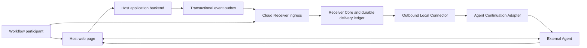

# Re-entry Core — System Architecture

**Role:** CANONICAL system-wide architecture overview  
**Status:** Application-neutral Core and loopback Stage 1 Cloud Receiver shell locally verified;
selected application, production profiles, Local Connector, and concrete Agent runtime open  
**Authority:** ADR-0006 through ADR-0015 and ADR-0019

## 1. Objective

Define one application-neutral architecture that lets a Host website issue bounded future
continuation authority without giving the Host, Receiver, Connector, or Agent more authority than
its role requires.

This document owns topology, component responsibility, system lifecycle, and integration seams.
Detailed module contracts belong to [Docs/Mechanisms](../Mechanisms/README.md). Exact durable
choices belong to ADRs; current evidence belongs to Core/00 and Core/05.

## 2. Architectural invariants

1. Host business truth and Receiver continuation authority are separate.
2. Manifest enrollment and later event acceptance are separate operations.
3. Viewing an offer creates no Grant.
4. The Host receives an opaque binding, never a raw Grant or Agent-context locator.
5. The event carries bounded typed transition data, not a prompt, artifact, or tool plan.
6. Accepted event, pending delivery, activation attempt, Host effect, and acknowledgement are
   separate states.
7. The Cloud Receiver and local development service use the same Receiver Core.
8. The Local Connector is outbound-only and cannot issue or reinterpret authority.
9. Context selection occurs only inside the selected Agent Adapter's private boundary.
10. Re-entry returns to the canonical page and revalidates current state and tools.
11. Human and Agent interfaces share backend authorization and state rules.
12. Unsupported capability fails visibly; no hidden fallback exists.

## 3. Component topology



| Component | Owns | Does not own |
|---|---|---|
| Host web page | Human UI, current-state presentation, genuine state-derived Site Tools, re-entry explanation | Receiver or Agent credentials |
| Host backend | Workflow state, authorization, artifact revisions, business transitions, event outbox, issuer key | Consent, delivery, or Agent activation |
| Cloud Receiver shell | Authenticated ingress, service identity, Core lifecycle, durable work availability | A second Receiver algorithm or device control |
| Receiver Core | Challenge, Grant, event, replay, reservation, delivery, revocation, acknowledgement rules | Host mutation or Agent execution |
| Durable delivery ledger | Pending, lease, attempt, effect, acknowledgement, expiry, terminal projection | Business-event truth or Agent instruction |
| Local Connector | Paired-target retrieval, lease handoff, adapter dispatch, acknowledgement request | Grant issuance, event interpretation, public inbound control |
| Agent Adapter | Private context resolution and one bounded activation attempt | Event acceptance, Host effect, delivery acknowledgement |
| Agent runtime | Managed context, Browser capability, navigation, Site Tool invocation | Receiver authority or human consequence |

## 4. End-to-end lifecycle

### Phase A — Enrollment

1. The Host backend signs one bounded Manifest for the current workflow state.
2. The live page exposes the Manifest through genuine WebMCP.
3. The Receiver verifies the trusted page origin and issuer.
4. The Receiver creates a challenge with no Grant.
5. A Receiver-owned authenticated human decision may create one private Grant, one public Host
   binding, and one private receipt.

### Phase B — Waiting

1. The page or Agent turn may end.
2. The Host retains only the opaque binding.
3. The Receiver retains effective Grant and delivery authority.
4. No Agent work exists until a matching event is accepted.

### Phase C — Authoritative transition

1. The Host commits its business transition and event intent atomically.
2. The outbox delivers the same signed typed event at least once.
3. Receiver Core verifies the event against the private live Grant.
4. One transaction records event truth, consumes the run, and creates one pending delivery.
5. Event acceptance performs no Agent call.

### Phase D — Delivery and activation

1. An authenticated eligible Connector claims one short lease.
2. The Connector derives a credential-free activation.
3. The selected Adapter resolves the private managed-context binding.
4. One driver call attempts activation and returns one bounded result.
5. Adapter acceptance is not Host-effect evidence.

### Phase E — Re-entry and completion

1. The Agent opens the allowlisted canonical Host URL.
2. The Host revalidates identity, permission, workflow state, state version, and artifact revision.
3. The page registers only the Site Tools valid for current state.
4. The Agent continues the same visible artifact or decision.
5. The Agent stops before the selected human consequence.
6. A separate trusted authority may prove one correlated Host effect for delivery acknowledgement.

## 5. Integration contracts

| Contract | Project owner | Integrator obligation | Current status |
|---|---|---|---|
| Host backend to Receiver | Re-entry protocol and Host SDK | issuer identity, signed Manifest/event, outbox, canonical workflow | application-neutral kernel locally verified |
| Receiver to Connector | Receiver Core and transport contract | target identity, outbound claim, lease, effect-backed acknowledgement | bounded local contract locally verified |
| Connector to Agent runtime | Agent Adapter and binding contract | private binding custody, activation, Browser and WebMCP evidence | deterministic contract verified; concrete runtime open |
| Agent to Host page | selected Host application | canonical page, current authority, dynamic Site Tools, persistent artifact, human boundary | target only; frozen MVP1 evidence |

These contracts are versioned and verified separately. Conformance on one does not prove the next.

## 6. Deployment profiles

### Target production profile

```text
Host application and backend
-> hosted Cloud Receiver shell
-> shared Receiver Core and durable store
-> paired outbound Local Connector
-> selected Agent Adapter and runtime
```

This is the selected reference topology, not a deployed result.

### Local development profile

`runtime/cloud-receiver/` now runs the same Receiver Core behind a loopback-only service shell with
file-backed SQLite, bounded operational routes, and graceful shutdown. A trusted composition must
supply the authority ports. Deterministic authorities remain test-only. This profile exists for
development and evidence; it is not an automatic shipping fallback or public deployment profile.

### Alternative hosted-Agent profile

A hosted Agent may replace the Local Connector path only through a later ADR proving compatible
Browser, genuine page-bound WebMCP, authority, context, and evidence behavior. It cannot silently
replace the selected topology.

## 7. Application boundary

The selected application must implement:

- one durable workflow and canonical page;
- one asynchronous later event;
- one persistent artifact or decision;
- initial and resumed state models;
- normal human UI and genuine WebMCP tools;
- backend authorization, stale-state, and revision controls;
- one human consequence boundary;
- event outbox and issuer-key custody; and
- deterministic synthetic reset and judge path.

The application specializes the Host-facing module. It does not fork Receiver Core or place domain
business rules in the Connector.

## 8. Current as-built boundary

`reentry-core/` implements the first four application-neutral mechanism contracts and their
source conformance profile. Local tests cover protocol, Receiver authority, durable reference
state, delivery, HTTP mapping, outbound client, deterministic adapter, private binding resolution,
and bounded process-fault compositions.

`runtime/cloud-receiver/` implements the ADR-0019 Stage 1 listener, operational readiness, durable
composition, and process lifecycle around those unchanged contracts. Its local tests cover one
generic event, claim, effect acknowledgement, store reopen, exact acknowledgement replay, and
signal-driven process closure.

The repository still does not contain the selected Host application, public Receiver profile,
Local Connector process, public TLS, pairing, production identity, real binding custody, real
Host-effect verification, real Agent activation, Browser acquisition, or WebMCP runtime access.
Those gaps remain visible rather than being filled with test authorities or implicit fallback.

## 9. Module routing

- Enrollment and public/private authority split:
  [Mechanism 01](../Mechanisms/01-host-integration-manifest-and-enrollment.md)
- Grant, event, replay, revocation, and pending work:
  [Mechanism 02](../Mechanisms/02-receiver-grant-and-event-authority.md)
- Lease, Connector, transport, and acknowledgement:
  [Mechanism 03](../Mechanisms/03-delivery-lease-and-local-connector.md)
- Context selection and activation:
  [Mechanism 04](../Mechanisms/04-managed-context-and-agent-activation.md)
- Canonical page, WebMCP, continuation, and human boundary:
  [Mechanism 05](../Mechanisms/05-host-reentry-webmcp-and-human-boundary.md)

## 10. Open architecture decisions

The application-selection ADR and later runtime decisions must still choose:

- Host domain, user, event, artifact, tools, and human boundary;
- production Receiver identity, storage, key lifecycle, and service ownership;
- Connector pairing, credential custody, supervision, and offline behavior;
- concrete Agent adapter, binding capture, Browser path, and WebMCP runtime;
- real Host-effect proof and acknowledgement integration; and
- deployment, observability, retention, recovery, and judge reproduction.
