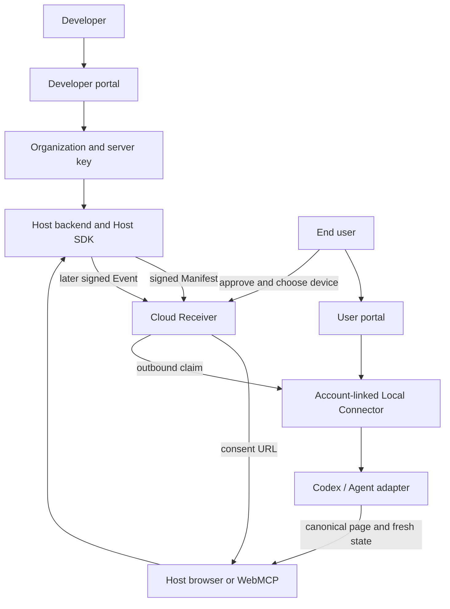

# Re-entry Core - Business Flows and UX

**Role:** CANONICAL cross-layer sequence and user-experience contract  
**Status:** Current cross-layer baseline with Sleepless Kingdom selected; active v2, standing-mode,
Game-integration, and release gates visible  
**Last updated:** 2026-09-03  
**Scope:** Re-entry account portals, Host SDK handoff, consent, event delivery, Local Connector,
Codex continuation, and the selected Sleepless Kingdom Host mapping  
**Authority:** [Core/00](00-current-status.md), [Core/02](02-product-requirements.md), [Core/03](03-system-design.md), [Mechanisms](../Mechanisms/README.md), and accepted ADRs

> **Implementation status:** `saas-boilerplate/` is the active Cloud Receiver v2 implementation
> selected by ADR-0033 and extended through ADR-0041. The separate
> `runtime/cloud-receiver/` implementation is deprecated historical evidence under
> [ADR-0032](../Decisions/ADR-0032-retire-current-cloud-receiver-runtime.md). The active v2 service
> is locally and separately-process verified only at the boundaries stated below; it is not a
> production-ready or exact-Git deployment claim.

## 1. Purpose

This document is the single sequence map for the target Re-entry flow, the active v2 preview, and
the explicitly separated retired v1 history. It explains who does what, on which page or process,
through which API, with which stored state, and what happens next.

It exists to connect the existing authorities without replacing them:

- `Docs/Core/` owns product-wide intent, requirements, architecture, and current truth;
- `Docs/Mechanisms/` owns the detailed authority and lifecycle contract for each Re-entry block;
- `Docs/Decisions/` owns accepted durable choices and supersession;
- `Docs/Development/` owns implementation history and evidence; and
- current code and tests own as-built behavior.

This document owns the cross-layer order and UX handoffs. It does not repeat full wire schemas,
cryptographic rules, lease rules, or database migration detail. Those remain in the linked owners.

ADR-0042 selects Sleepless Kingdom as the Host and challenge-demo carrier. This remains the
domain-neutral cross-layer baseline; the scoped Game authority adds the shelter mission,
`CargoLostToMonster`, canonical page reads, conditional recall, and human-confirmed consequence
boundary without changing Re-entry authority. ADR-0043 through ADR-0045 separately accept standing
authorization, independent-Receiver conformance, and v0.2 transport. RECORE-007 locally verifies the
low-level Host SDK/HTTP/Core/Connector/Adapter reference. CLOUD-023 separately records the active
Receiver's locally verified working-tree standing kernel and additive migration; public controls
and pinned release remain open. Normal Host facade, product Connector, Game, and external-runtime
evidence remains v0.1 or unadapted until TASK-028 and TASK-033 close adoption.

### 1.1 Selected Host join

```text
Sleepless Kingdom page and backend
-> advanced Host SDK Manifest and Receiver-owned Consent [OPEN in Game]
-> authoritative CargoLostToMonster signals [two sequential cycles for the v0.2 proof]
-> Cloud 202 = durable queue acceptance only
-> Connector claim -> Agent activation -> authenticated canonical page [OPEN as one chain]
-> fresh shelter, mission, and history reads
-> conditional force_recall_soldier
-> independent Game effect proof -> delivery acknowledgement [OPEN]
```

The Game has bounded local evidence on both sides of the external join. Those results are not
collapsed into a true-chain claim.

### 1.2 Evidence and drift labels

Every flow below separates implementation state from evidence quality.

- **TARGET** - the intended product behavior that an integration must follow;
- **ACTIVE V2** - behavior present in `saas-boilerplate/`, without implying production readiness;
- **HISTORICAL** - retained compatibility or evidence from an older path; it is not the normal flow;
- **OPEN** - not selected, not implemented, or not verified; and
- **AUDIT** - a current inconsistency or decision gap found while reconciling the flow.

Evidence labels are **VERIFIED**, **INFERRED**, **MEMORY-ONLY**, **UNKNOWN**, and **CONFLICTED**.
Memory is used only as a lead and never substitutes for current source, test, Git, or runtime
evidence. Drift is classified as: **A** code evolved reasonably and documentation lagged; **B** code
may have deviated or regressed; **C** earlier documentation may require a new architecture decision;
**D** code and documentation are incomplete or contradictory; **E** deprecated material remains;
or **F** evidence or an owner decision is missing. A-class documentation drift may be corrected
directly. B, C, D, and F findings remain findings or decision gates until accepted; they are not
silently promoted into normative architecture.

Planning language does not raise an item above `OPEN`. Local tests do not prove hosted, cross-machine,
production identity, Browser, WebMCP, or supported Agent behavior.

## 2. Product model in one view

Re-entry has two setup audiences and one later continuation loop:



The important business meaning is:

```text
Developer setup creates a Host connection.
User setup connects a Mac.
Host consent creates permission for a future return.
A later Host business event creates delivery work.
The Connector brings Codex back to the Host page.
```

No single participant owns all of this chain.

## 3. Actors and ownership

| Actor or surface | Owns | Must not own or receive |
|---|---|---|
| Developer | Re-entry account used for development, organizations, Host integration, business rules | End-user Connector bearer or browser consent cookie |
| Organization | Product or environment boundary and its server API keys | A user session or private Agent context |
| Host backend | Host user identity, workflow state, business transition, Host signing key, continuation mapping, event outbox | Re-entry account identity, Connector credential, or raw Agent context |
| Host browser page | Normal UI, user-triggered handoff, genuine WebMCP Site Tool, visible artifact | Organization key, Host private key, raw binding, or event authority |
| Re-entry account | End-user browser session, consent decision, connected devices | Host business truth or Host private signing key |
| Cloud Receiver | Consent, Grant, event acceptance, delivery state, lease, and acknowledgement authority | Host business mutation or hidden Agent control |
| Local Connector | Outbound polling, delivery claim, local credential custody, adapter dispatch | Grant issuance, event reinterpretation, public inbound listener |
| Codex / Agent adapter | One bounded local activation and continuation attempt | Receiver authority, Host effect proof, or human approval |

### 3.1 Account separation rule

**TARGET:** Developer and end user are different product roles with different credentials and portal
purposes.

**ACTIVE V2 / VERIFIED:** The active Prisma schema uses separate `DeveloperAccount` and
`UserAccount` tables, separate `developer_session` and `user_session` cookies, and separate
authentication route families. An email address may independently exist in both tables; there is no
shared role or membership model.

Before production identity or organization membership is implemented, the project must still decide
whether:

1. one account may be both a developer and an end user;
2. a developer can invite or link a different end user; and
3. organization membership and user-device ownership need separate authorization roles.

The flow must not imply cross-account linkage, invitations, organization membership, or production
identity assurance that the active schema does not provide.

## 4. Canonical browser routes

These are the normal entry points. A compatibility route may remain available, but it must redirect
to a canonical route and must not become a second documented user journey.

| Route | Audience | Purpose | Normal result |
|---|---|---|---|
| `GET /` | Everyone | Explain Re-entry and choose an audience | User sign-in, developer access, or public guide |
| `GET /login` | End user | Compatibility entry for user sign-in | `/dashboard`, or exact validated consent return |
| `GET /user-login` | End user | Sign in for Mac pairing or consent | `/user-dashboard`, or exact validated consent return |
| `GET /user-register` | End user | Create a user account for Mac pairing | `/user-dashboard` |
| `GET /dashboard` | End user | Account overview | User account overview |
| `GET /user-dashboard` | End user | Create a one-time pairing code and view connected Macs | Code is entered in the Local Connector |
| `GET /dashboard/devices` or `/user-dashboard/devices` | End user | View the device-pairing surface | Pairing code or connected-device list |
| `GET /dashboard/contracts` or `/user-dashboard/contracts` | End user | View the current placeholder contracts surface | Preview-only account content |
| `GET /developer-register` | Developer | Create a developer account for Host setup | `/developer-dashboard` |
| `GET /developer-login` | Developer | Sign in to the developer portal | `/developer-dashboard` |
| `GET /developer-dashboard` | Developer | Manage owned organizations, keys, Event history, and SDK guidance | One in-page organization workspace |
| `GET /consent?token=...` on the Receiver origin | End user | Review and approve or decline one Host request | Grant and device binding, or no Grant |
| `GET /docs` | Public/end user | Read the device and account guide | No authentication required; this is not the developer SDK guide |

### 4.1 Redirect matrix

The destination is part of the business flow, not a cosmetic frontend detail.

| Entry or requested route | If unauthenticated | Canonical authentication | Success destination |
|---|---|---|---|
| `/login` | Stay on user login | User login | `/dashboard`, unless an exact consent `return_to` is present |
| `/register` | Redirect to `/developer-register` | Developer registration | `/developer-dashboard` |
| `/developer-login` or `/developer-register` | Stay on matching developer auth | Developer auth | `/developer-dashboard` |
| `/developer-dashboard` | Client redirects to `/developer-login` after failed developer-session read | Developer login | `/developer-dashboard` |
| `/user-login` or `/user-register` | Stay on matching user auth | User auth | `/user-dashboard`, unless an exact consent `return_to` is present |
| `/dashboard` or `/user-dashboard` | User-session UI handles unauthenticated state | User login | Requested user dashboard family |
| Receiver `/consent?token=...` without a user session | Redirect to frontend `/user-login?return_to=<exact Receiver consent URL>` | User login | Return to the same Receiver consent request |

Rules:

1. Developer authentication returns to `/developer-dashboard`; organization selection is in-page.
2. User authentication may return to the matching user dashboard or an exact Receiver-origin
   `/consent` URL carrying one token.
3. The normal CLI pairing flow opens the Receiver compatibility `/user-register` URL, which redirects
   to the configured frontend; it never uses developer authentication.
4. A `next` value is a route continuation hint, not an authority. The server validates it and the
   rendered form carries the canonical success path.
5. A popup message or query parameter never proves consent, identity, or a Host business event.

## 5. Flow A - Developer creates a Host connection

The developer portal configures the website integration. It does not connect a user's Mac and does
not approve a future continuation.

| Step | Page or process | Action and API | Stored state | Success | Failure or stop |
|---|---|---|---|---|---|
| A1 | Landing page | Developer chooses **Create account** | None | `/developer-register` | Remain on landing page |
| A2 | Developer registration | Submit email and password to `POST /v1/auth/developers/register` | One developer account and one typed browser session; no organization | `/developer-dashboard` | Show invalid credential or duplicate-account error |
| A3 | Developer login | Submit credentials to `POST /v1/auth/developers/login` | New developer session | `/developer-dashboard` | Show generic invalid-credential error |
| A4 | Developer dashboard | `GET /api/organizations` | Read only organizations owned by this developer | List existing organizations or **New organization** | Require developer session |
| A5 | Developer dashboard | Create with `POST /api/organizations` | Organization plus first API-key digest | Select the organization in-page; reveal the full key once | Keep the dashboard visible and show creation error |
| A6 | Developer dashboard | Create or list keys through `/api/organizations/:id/api-keys`; read `/events` | Key digest, prefix, lifecycle, and redacted Event/delivery projection | Copy one newly revealed secret into Host server environment | Never render a stored full secret or raw Event body |
| A7 | Host server setup | Create the Host signing key in Host-controlled secret storage and configure the server-only simple SDK facade | Receiver receives only the public key and issuer metadata through idempotent registration on an explicit `request` | Host is ready to request consent with a subject, prompt, and URL | Never configure or register from browser code |
| A8 | Host application | Add server routes using the organization key and `request`, `confirm`, and `trigger` | Host-specific request handle and approved continuation | Browser can request Re-entry consent; later business logic can trigger once | Host integration remains incomplete until server routes load real Host state and persist the returned server-only values |

The organization API key authenticates Host-to-Receiver control calls. It is not a browser key, a
user login credential, a Connector credential, or a Host signing key.

### 5.1 Developer portal target

**ACTIVE V2 / VERIFIED:** The developer path is:

```text
/developer-register or /developer-login
    -> /developer-dashboard
    -> in-page organization selection
    -> one-time organization key reveal and Host SDK setup
```

The active `/dashboard` route is a user account route, not a developer route. The retired v1 preview
that mixed organization setup and **Pair this Mac** under one dashboard remains historical only.

## 6. Flow B - End user connects a Mac

The user portal connects the machine where Codex should open. The user does not need an organization
API key, Host signing key, or Host account.

| Step | Page or process | Action and API | Stored state | Success | Failure or stop |
|---|---|---|---|---|---|
| B1 | Local terminal | Run `re-entry install` with a Host project directory | No Receiver state yet | Run local Node, Codex, and workspace checks | Stop before any claim if preflight fails |
| B2 | Local terminal | Connector opens `RECEIVER_ORIGIN/user-register?next=/user-dashboard` | No browser credential copied to CLI | Browser opens the user portal | Show URL if automatic browser opening fails |
| B3 | User registration or login | Submit to `POST /v1/auth/users/register` or `POST /v1/auth/users/login` | Typed user-session cookie | `/user-dashboard` | Stay on user auth page and show an error |
| B4 | User dashboard | Load `GET /v0.1/account/connectors` | Read account-owned devices | Show connected Macs | Require user session |
| B5 | User dashboard | Click **Create pairing code**; call `POST /v0.1/account/pairing-sessions` | Store only pairing-code digest and pending connector identity | Display raw short-lived code once | Show a visible request error; do not silently retry |
| B6 | Local terminal | User types the displayed code; Connector calls `POST /v0.1/account/pairing-sessions/claim` | Atomically consume code and create account-linked Connector | Return one delivery-only credential | Reject expired, consumed, or invalid code |
| B7 | Local Connector | Save credential in the local restricted store; install and start a per-user macOS LaunchAgent | Local credential file, service profile, local logs | Connector runs at login and polls outbound | Tell user to reconnect or repair local service |
| B8 | Local Connector | Poll `/v0.1/delivery-claims` using Connector credential | Receiver delivery lease when work exists | Claim one delivery | Empty poll is not business success and does not mutate Host state |
| B9 | Local terminal | Run `re-entry disconnect`; CLI posts its saved token to `/v0.1/connectors/disconnect` before local cleanup | Receiver stamps `revoked_at`; Connector row remains; local credential and service are removed after confirmation | Dashboard shows the Mac as disconnected; future consent and claims exclude it | Remote failure preserves the local credential so the user can retry; browser session remains signed in |

The Receiver never opens a connection into the Mac. The Connector initiates every request. The
Connector credential authorizes delivery only and never enters the Codex prompt or browser bundle.

### 6.1 Install versus connect

**TARGET:**

- `install` is the normal first-run command: preflight, account pairing, credential storage, and
  background service installation;
- `connect` repeats only account authorization when the saved credential is missing, expired, or
  rejected; and
- `start` runs or observes the already configured Connector and waits for work.

The first-run user journey must not ask the user to understand legacy device authorization, Host
codes, or a Receiver approval page.

## 7. Flow C - Host asks for future consent

Consent is permission for a possible future event. It is not the event, not a business mutation, and
not proof that Codex has already done work.

### 7.1 Preconditions

1. The developer has an organization API key and Host signing key in the Host backend.
2. The Host backend knows the authenticated Host user and current workflow.
3. The Host page has a canonical URL and a genuine current-state WebMCP tool surface.
4. The end user has connected at least one eligible Mac if approval must target a device.

### 7.2 Sequence

| Step | Page or process | Action and API | Stored state | Success | Failure or stop |
|---|---|---|---|---|---|
| C1 | Host browser | User clicks a normal button or Agent invokes the top-level `request_codex_reentry` Site Tool | No Grant | Call the Host-owned consent route | Normal UI remains usable if WebMCP is unavailable |
| C2 | Host backend | Load the authenticated Host subject, consent prompt, and exact canonical URL; call the simple facade | Server-only request handle; Receiver persists the Consent session and token digest | Facade registers the public Host key idempotently, derives and signs the Manifest, then calls `POST /v0.1/consent-sessions` with organization auth | Reject missing or stale Host state before Receiver call; registration failure creates no Consent session |
| C3 | Host browser | SDK receives `consent_url` and `consent_session_id`; shows its small handoff dialog | Browser holds only bounded handoff data | User clicks **Review in Re-entry** | Show popup-blocked or Receiver-origin failure visibly |
| C4 | Re-entry consent page | Open `GET /consent?token=...` on the Receiver origin | Read the already-persisted session by token digest | Show request scope and available devices | Invalid or expired request stops without a Grant |
| C5 | Re-entry user auth | If needed, redirect to `/user-login?return_to=<exact Receiver consent URL>` | Re-entry browser session | Return to the same consent request | Do not lose or replace the consent token |
| C6 | Re-entry consent page | User reviews scope, chooses a connected Mac, and clicks **Approve** or **Decline** | Decision, target device, Grant, and opaque binding are Receiver-owned | Approval creates one bounded Grant and binding | Decline creates no Grant; no-device approval is disabled |
| C7 | Re-entry consent page | Browser posts same-origin JSON from the configured Receiver origin to `POST /v0.1/account-consent-decisions` | Consent session becomes terminal | Show approved or declined result | Reject other origins; keep action visible and allow a safe refresh if request fails |
| C8 | Host browser | Receiver `/consent` preserves its cross-origin opener and sends only a completion notification with session ID and status to the exact signed Host origin; SDK requires the exact Receiver sender and popup source | No authority is created by `postMessage`; other Receiver routes retain the stronger opener policy | Host calls its server confirmation route | A missing, severed, misdirected, or forged message is harmless |
| C9 | Host backend | Call `GET /v0.1/consent-sessions/:id` with organization auth; require `approved` | Host stores opaque binding against authenticated Host user and workflow | Return only a safe `continuation_id` to browser code | Pending, declined, expired, or mismatched status is not saved as approval |

The Host page's dialog is a handoff surface. The Re-entry consent page is the human decision
surface. The Host backend confirmation is the authority that lets the Host record the continuation.

### 7.3 What approval does and does not do

Approval:

- creates one Receiver-owned, bounded Grant;
- selects an eligible account-linked Connector when required;
- creates an opaque Host binding; and
- permits one later matching event within the defined scope and expiry.

Approval does not:

- submit, publish, purchase, or commit the Host business record;
- start Codex immediately;
- grant prompt authority to the Connector or accept a changed instruction from the later Event;
- expose a raw Grant, account ID, Connector credential, or managed-context locator to the Host; or
- authorize a later event that does not match the current Grant scope.

The signed, user-visible Manifest reason may later be copied unchanged into the delivery as one
bounded untrusted instruction. Consent covers that exact text; it is not a tool plan, system
message, business-effect authority, or substitute for current page state.

## 8. Flow D - A later business event returns to Codex

The later event must come from the Host's real business logic. The initial consent action must not
call it merely because the user clicked **Approve**.

| Step | Page or process | Action and API | Stored state | Success | Failure or stop |
|---|---|---|---|---|---|
| D1 | Host backend | A real business condition occurs; commit the Host transition and event intent together | Host workflow state and outbox intent | One signed typed Event can be sent | No event if the Host transition did not commit |
| D2 | Host backend | Load the approved server-only continuation and call `trigger` when the real business condition occurs | No browser authority | Facade creates the one matching signed Event and `POST /v0.1/events` reaches Receiver | Reject stale binding, wrong workflow, wrong origin, expiry, or signature |
| D3 | Cloud Receiver | Resolve private Grant; validate event; atomically record event, spend run, and create delivery | Event acceptance plus `PENDING` delivery | One delivery becomes claimable | Replay returns prior acceptance; invalid event creates no delivery |
| D4 | Local Connector | Poll outbound and claim a short lease | Delivery becomes `LEASED` | Receive credential-free continuation context plus the immutable consented instruction | Empty queue remains idle; stale lease is fenced or reclaimed within bounds |
| D5 | Connector adapter | Frame the instruction as untrusted data, resolve private context by Receiver receipt, and attempt one activation | Adapter result | Current preview starts one fresh local `codex exec` process with the exact canonical URL and safety frame | Malformed instruction, unsupported capability, rejection, timeout, or unknown result remains visible before business effect |
| D6 | Codex / Agent | Open the allowlisted canonical Host URL and read current state | No Receiver authority added by the page | Fresh state and current Site Tools are discovered | Auth, origin, workflow, state, or tool mismatch stops before mutation |
| D7 | Host page | Continue the visible draft or decision using current-stage tools | Host artifact revision changes only through Host rules | Agent stops at the human-only consequence | Stale writes or invalid tools return visible conflicts |
| D8 | Trusted effect authority | Verify one exact Host effect correlated to the delivery | Delivery effect evidence | Receiver records acknowledgement | Adapter success, process exit, or narration alone is not acknowledgement |

The delivery state is not the same as the Host business state:

```text
event accepted
  != delivery claimed
  != adapter accepted
  != Codex process started
  != Host effect committed
  != delivery acknowledged
```

The current preview has a fresh local Codex process seam, and a separate test harness proves one
effect-verifier/acknowledgement path. The default installed Connector has no product effect authority
or acknowledgement composition, and no evidence yet proves a supported Browser attachment, real
page-bound WebMCP join, or production Agent runtime.

## 9. State machines

### 9.1 Account and portal state

```text
ANONYMOUS
  -> AUTHENTICATED
  -> ORGANIZATION_CHOOSER
  -> ORGANIZATION_SELECTED
  -> HOST_CONFIGURED
```

The user portal uses its own account table and `user_session`, independently from the developer
portal's `DeveloperAccount` and `developer_session`:

```text
ANONYMOUS
  -> AUTHENTICATED
  -> USER_DASHBOARD
  -> PAIRING_CODE_ISSUED
  -> CONNECTOR_CONNECTED
  -> CONNECTOR_DISCONNECTED
```

Registration does not create an organization. Pairing-code creation does not create consent or a
Grant.

### 9.2 Consent and continuation state

```text
NO_CONSENT
  -> CONSENT_PENDING
  -> APPROVED + GRANT_ACTIVE
  -> EVENT_ACCEPTED
  -> DELIVERY_PENDING
  -> DELIVERY_LEASED
  -> ACTIVATION_ATTEMPTED
```

Terminal or alternate outcomes are explicit:

```text
CONSENT_PENDING -> DECLINED | EXPIRED
GRANT_ACTIVE    -> REVOKED | EXHAUSTED | EXPIRED
DELIVERY_LEASED -> RECLAIMED | RETRY_EXHAUSTED | ACTIVATION_ATTEMPTED
ACTIVATION_ATTEMPTED -> EFFECT_VERIFIED -> ACKNOWLEDGED
ACTIVATION_ATTEMPTED -> REJECTED | UNSUPPORTED | OUTCOME_UNKNOWN
```

No alternate outcome silently becomes success. No automatic retry is allowed across an unknown
external outcome unless a later accepted contract explicitly defines reconciliation.

## 10. Data and credential boundaries

| Value | Owner and storage | May cross into | Must never cross into |
|---|---|---|---|
| Re-entry browser sessions | Separate user/developer JWT cookies; corresponding account routes only | Credentialed Re-entry portal requests | Host backend, Connector credential file, or the other account type's authorization |
| Organization API key | Developer secret manager or Host server environment; digest in Receiver | Host server control calls | Browser bundle, Host page, Connector, Codex prompt |
| Host signing private key | Host backend secret storage | Host SDK server methods | Browser, Receiver database, Connector, Codex |
| Host public signing key | Receiver organization/Host-key record | Receiver verification | Not sensitive, but not a substitute for private key custody |
| Consent token | Short-lived URL and Receiver-side digest | Re-entry consent page and validated user-auth redirect | Logs, Host business state, Connector, Codex |
| Host binding | Host continuation record as an opaque value; Receiver keeps private receipt | Host server confirmation and later Event creation | Browser binding store, Connector prompt, raw Agent context |
| Connector credential | Local restricted file; Receiver keeps digest and durable revocation time | Connector pairing-lifecycle and delivery requests | Host backend, browser JavaScript, Codex prompt |
| Manifest and Event | Host-created signed protocol objects | Receiver validation | Arbitrary prompt, artifact, or tool plan fields |
| Workflow and artifact | Host database and canonical Host page | Host SDK server and Host Site Tools | Receiver as business source of truth |
| Delivery lease | Receiver delivery ledger | Connector adapter as bounded activation input | Host business logic as proof of effect |

The active v2 relational model is in `saas-boilerplate/backend/prisma/schema.prisma`: separate user
and developer identity, Connector pairing, organizations and API keys, Host keys, Consent sessions,
subject bindings, Grants, Events, Deliveries, and Delivery Attempts. ADR-0031 documents only the
retired v1 relational layout and must not be used as the active v2 schema authority.

## 11. Current reconciliation findings

[TASK-012](../Tasks/TASK-012-reconcile-business-flow-and-implementation.md) owns this register's
documentation lifecycle. A finding records evidence and disposition; it does not authorize its own
code, migration, deployment, or architecture change.

### AUDIT-V2-001 — Pairing claim abuse fence is not enforceable as documented

| Field | Record |
|---|---|
| Severity | **P0** |
| Status and confidence | `decision_required`; high confidence; **CONFLICTED** |
| Affected component / flow / contract | Active v2 anonymous pairing claim; pairing-code confidentiality and account-to-Connector authorization |
| Current behavior | The service generates an eight-hex-character code, looks up its digest, checks `failedAttempts >= 5`, and consumes a matching live row. No path increments `failedAttempts`, and the anonymous claim route has no rate limiter. A wrong code cannot be associated with a pairing row because the request carries no separate pairing identifier. |
| Intended / documented behavior | ADR-0033 says the code permits at most five failed claims and the sixth returns `410 pairing_expired`. |
| Exact evidence | `saas-boilerplate/backend/src/modules/connectors/pairing.service.ts:6-9,65-66,167-225`; `pairing.routes.ts:39-43`; `middleware/rateLimiter.ts:9-16`; `prisma/schema.prisma:36-49`; ADR-0033 Sections 2 and 3; `PAIR-001` through `PAIR-006` contain no failed-attempt case. |
| Risk and impact | The accepted abuse boundary is absent. Repeated anonymous guesses are bounded only by 32-bit code entropy and deployment-layer controls not evidenced here; the documented terminal response cannot occur for a wrong code. |
| Drift class | **D** — the decision and implementation do not form a complete enforceable contract. |
| Recommended disposition | Before production or wider preview use, choose one coherent abuse-control contract: a correlatable challenge plus atomic attempt budget, or a separately specified anonymous rate-limit/entropy design. Preserve tokenless exact duplicate replay. |
| Documentation owner | Core/04, Mechanism 03, this register, and [TASK-026](../Tasks/TASK-026-reconcile-pairing-claim-abuse-fence.md). |
| Change gates | Code: **yes**. ADR/owner decision: **yes**. Migration: conditional on chosen identity/counter design. Tests: **yes**, including concurrency, restart, terminal response, and no secret leakage. |

### AUDIT-V2-002 — Effective Grant lifetime is silently collapsed to the consent window

| Field | Record |
|---|---|
| Severity | **P1** |
| Status and confidence | `decision_required`; high confidence; **CONFLICTED** |
| Affected component / flow / contract | Consent session, effective Grant expiry, simple facade, and user-visible consent scope |
| Current behavior | The simple facade derives a five-minute offer and a thirty-minute requested Grant. Active v2 computes one Consent-session expiry as the minimum of ten minutes, offer expiry, and requested Grant expiry; approval copies that same time into the Grant. The consent page does not display the effective expiry. |
| Intended / documented behavior | ADR-0007 makes offer and requested Grant expiry distinct and allows Receiver narrowing; Core/04 requires the user to understand expiry; ADR-0041 presents a later-event continuation. No accepted record explicitly selects an approximately five-minute effective Grant for the simple flow. |
| Exact evidence | `runtime/host-sdk/src/server.mjs:76-77`; `saas-boilerplate/backend/src/modules/consent/consent.service.ts:190-227,368,576-594`; `consent-page.ts:77-101`; ADR-0007 Section 2; ADR-0041 Sections Decision and Consequences; `CONSENT-001` and `SDK-V2-002` assert the collapsed projection. |
| Risk and impact | An otherwise valid asynchronous business Event after the short consent window is rejected although the SDK requested a longer one-run Grant; the user is not shown the narrowed lifetime. Existing green tests encode the current behavior but do not establish that it is the intended product policy. |
| Drift class | **D** — current implementation and accepted product/UX intent are incomplete at this boundary. |
| Recommended disposition | Decide separate Consent-session and effective-Grant policies, render the exact effective expiry, and test Events on both sides of each boundary. Do not widen existing Grants silently. |
| Documentation owner | Core/04, Mechanisms 01 and 02, this register, and [TASK-027](../Tasks/TASK-027-reconcile-consent-and-grant-expiry.md). |
| Change gates | Code: **yes**. ADR/owner decision: **yes**. Migration: owner decision for already-created pending sessions or Grants. Tests: **yes**, including delayed Event and displayed expiry. |

### AUDIT-V2-003 — Default Connector runtime has no effect-to-acknowledgement completion path

| Field | Record |
|---|---|
| Severity | **P1** |
| Status and confidence | `implementation_verified`; high confidence; **VERIFIED** locally, including split-origin browser behavior; hosted release evidence not claimed |
| Affected component / flow / contract | Background Connector, Agent dispatch, Host-effect verification, acknowledgement, and retry exhaustion |
| Current behavior | `LocalConnector.runOnce()` claims and dispatches, and the CLI loop reports the activation result. Although the client exposes `acknowledgeDelivery()`, neither `start` nor `claim-once` obtains a trusted Host-effect attestation or calls it. The verified full-chain test uses a separate test-only effect file and acknowledgement worker. |
| Intended / documented behavior | ADR-0009 and ADR-0038 require separate trusted Host-effect verification before acknowledgement. ADR-0037 permits up to three lease attempts, so a non-acknowledged successful dispatch becomes eligible for reclaim and can end `retry_exhausted`. |
| Exact evidence | `runtime/local-connector/src/local-connector.mjs:45-65`; `src/main.mjs:841-876,929-944`; `cloud-receiver-v2-ack.contract.mjs` case `CONNECTOR-V2-ACK-001`; `cloud-receiver-v2-e2e.test.mjs:93-148`; ADR-0037 and ADR-0038. |
| Risk and impact | The default installed preview can dispatch the same delivery again after lease expiry and cannot reach terminal acknowledgement by itself. Process success must not be presented as completed Re-entry. |
| Drift class | **D** — the kernel contract exists, but the default product composition is incomplete. |
| Recommended disposition | Select a real Host-effect authority and explicit reconciliation path, then integrate it without treating adapter success or process exit as proof. Keep retry and unknown-outcome behavior visible. |
| Documentation owner | Core/03–05, Mechanism 03, Connector README, this register, and [TASK-029](../Tasks/TASK-029-integrate-connector-effect-acknowledgement.md). |
| Change gates | Code: **yes**. ADR/owner decision: **yes** for the concrete effect authority. Migration: no current need identified. Tests: **yes**, including lost response, repeat dispatch, and restart. |

### AUDIT-V2-004 — Independent active-v2 Receiver requires executable conformance

| Field | Record |
|---|---|
| Severity | **P1** |
| Status and confidence | `verification_pending`; high confidence; **ARCHITECTURE DECIDED** |
| Affected component / flow / contract | System topology, Receiver authority ownership, contract evolution, and conformance |
| Current behavior | The active v2 backend implements Consent, Grant, Event, delivery, lease, and acknowledgement rules in its own TypeScript services and declares no `reentry-core` dependency or import. |
| Intended / documented behavior | ADR-0044 preserves one normative Receiver authority model while allowing independently written implementations. `reentry-core` owns the reference and shared scenario; every active implementation must pass exact pinned black-box conformance through its real HTTP surface and durable store before release. |
| Exact evidence | `saas-boilerplate/backend/package.json:19-50`; active services under `backend/src/modules/{consent,events,deliveries}/`; ADR-0006 Section 3; ADR-0044 Sections 1–5; Core/03 Section 2. |
| Risk and impact | Two algorithms can drift despite shared tests; AUDIT-V2-002 is already an example of different expiry behavior. Fixes may land in one implementation only. |
| Drift class | **D** — the architecture is decided, but the mandatory active-v2 conformance and release evidence do not exist yet. |
| Recommended disposition | Pin and rerun the locally implemented v0.2 scenario adapter against the reviewed active-v2 Express/PostgreSQL source, retain production lease-profile regressions, and block migration/release claims until the full required gates pass. The working-tree trace is development evidence, not pinned conformance; matching names or copied tests are not substitutes. |
| Documentation owner | Core/01 and Core/03, Mechanisms 01–03, this register, and [TASK-028](../Tasks/TASK-028-reconcile-cloud-v2-receiver-core-architecture.md). |
| Change gates | Code: the adapter and additive standing migration exist in the locally verified working tree; exact-source verification and release enforcement remain open. ADR/owner decision: complete in ADR-0044. Migration: **yes**, reviewed committed-source verification. Tests: **yes**, including the full shared cross-implementation vectors, real state transitions, and active lease-profile regressions. |

### AUDIT-V2-005 — Canonical flow mapped the retired receiver and obsolete routes

| Field | Record |
|---|---|
| Severity | **P1** |
| Status and confidence | `documentation_updated`; high confidence; **VERIFIED** |
| Affected component / flow / contract | Core flow map, portal roles, routes, persistence, and active implementation routing |
| Current behavior | Before this reconciliation, this document called the Cloud Receiver deprecated, mapped `runtime/cloud-receiver/`, described a shared account/session, and listed routes absent from active v2. |
| Intended / documented behavior | ADR-0033 selects `saas-boilerplate/`; active v2 has separate accounts/cookies and the route families documented above. |
| Exact evidence | `saas-boilerplate/backend/src/routes/index.ts`; authentication, developer-portal, pairing, and consent routers; frontend `app/` route tree and `lib/api/`; this document's pre-reconciliation Sections 3, 4, 11, and 12. |
| Risk and impact | Developers and users could integrate against a retired service or nonexistent endpoint and misread account authority. |
| Drift class | **A/E** — reasonable active replacement evolution was missing from canonical docs while retired mappings remained. |
| Recommended disposition | Keep active v2 and retired v1 in separate lanes; rerun route and link checks whenever either application changes. |
| Documentation owner | Core/00, Core/01, Core/03–05, Core/09, Mechanisms, root README, and DOCS-004. |
| Change gates | Code: no. ADR: no. Migration: no. Tests: documentation/link/source checks only. Owner decision: no. |

### AUDIT-V2-006 — Host SDK guide demonstrated a retired Host-forwarded consent decision

| Field | Record |
|---|---|
| Severity | **P1** |
| Status and confidence | `documentation_updated`; high confidence; **VERIFIED** |
| Affected component / flow / contract | Developer integration guide and Receiver-owned consent authority |
| Current behavior | One later SDK README example called `sdk.decideConsent()` as though it were the normal flow. The active v2 exposes only user-cookie, Receiver-origin `/v0.1/account-consent-decisions`; `decideConsent()` targets the earlier `/v0.1/consent-decisions` compatibility contract. |
| Intended / documented behavior | New account-first integrations open the Receiver consent page and use server-side `getConsentSession()` confirmation. |
| Exact evidence | `runtime/host-sdk/README.md` Public methods section and former server-object example; `runtime/host-sdk/src/server.mjs:196-219`; `saas-boilerplate/backend/src/modules/consent/consent.routes.ts:41-47`. |
| Risk and impact | A developer following the example receives a route failure or attempts to put consent authority on the Host boundary. |
| Drift class | **A/E** — compatibility API remained in a current-looking example. |
| Recommended disposition | Keep compatibility exports labeled, but show only Receiver-owned consent plus server confirmation in the normal guide. |
| Documentation owner | Host SDK README and this register. |
| Change gates | Code: no. ADR: no. Migration: no. Tests: documentation/example review. Owner decision: no. |

### AUDIT-V2-007 — Release and deployed full-chain claims remain unattested

| Field | Record |
|---|---|
| Severity | **P1** |
| Status and confidence | `verification_pending`; high confidence; **VERIFIED** for the missing gates |
| Affected component / flow / contract | Git provenance, deployment, public browser flow, package release, and supported Agent join |
| Current behavior | Local/separate-process suites and bounded browser personas pass. SDK `0.3.1` is published from exact `gitHead` `9864ba0`, but it predates the checkout-only simple facade. Connector `0.2.20` reports root `gitHead` `733d77f`, but that commit records package version `0.2.14` and its registry tarball rejects the active instruction-bearing lease. The deployed Receiver/frontend snapshot is not contained in a recorded exact commit, a complete deployed consent/popup/status/Event run remains open, and no supported external Agent/Browser adapter is selected. |
| Intended / documented behavior | Release claims require exact committed source, CI/build identity, migration state, deployed readback, full correlated runtime evidence, and a supported concrete adapter. |
| Exact evidence | Core/00 Section 3; CLOUD-022 Sections Source and delivery state and Residual verification gate; SDK-006 Sections Source and delivery state and Residual gates; current root and nested Git status/SHAs; 2026-09-03 npm readback and immutable-tarball probes for `@4xeoz/re-entry-sdk@0.3.1` and `@4xeoz/re-entry@0.2.20`. |
| Risk and impact | Local evidence could be mislabeled as deployed, reproducible, or production evidence. |
| Drift class | **F** — external and release evidence is intentionally incomplete. |
| Recommended disposition | Close TASK-022 through TASK-024 with exact-source and external evidence, TASK-031 with a new immutable SDK version plus clean-consumer proof, and TASK-032 with an exact-source compatible Connector artifact. Do not use a fallback adapter or infer success from HTTP health. |
| Documentation owner | Core/00, Core/05, TASK-022 through TASK-024, TASK-031, TASK-032, CLOUD-021, CLOUD-022, and SDK-006. |
| Change gates | Code: not established. ADR: required for a selected adapter or changed deployment contract. Migration: release-dependent. Tests/runtime: **yes**. Owner authorization: **yes** for deployment/publication actions. |

### AUDIT-V2-008 — Cross-site logout can clear production session cookies

| Field | Record |
|---|---|
| Severity | **P2** |
| Status and confidence | `implementation_verified`; high confidence; **VERIFIED** locally, including split-origin browser behavior and the full backend aggregate; hosted release evidence not claimed |
| Affected component / flow / contract | User and developer browser sessions |
| Current behavior | Production session cookies use `SameSite=None; Secure`. Both logout routes now require the configured frontend `Origin` and `application/json` before clearing only their own cookie. Cross-origin and unsupported-content-type requests are rejected; same-origin logout remains idempotent and cannot clear the other account session. |
| Intended / documented behavior | State-changing browser endpoints should be bound to the intended origin/session boundary; Core/04 lists production anti-CSRF and session security as required. |
| Exact evidence | `saas-boilerplate/backend/src/modules/authentication/session.ts:18-45`; `users/user-auth.routes.ts`; `developers/developer-auth.routes.ts`; both logout controllers; `middleware/same-origin.ts`; and `saas-boilerplate/backend/src/modules/authentication/test/authentication.test.ts` cross-origin, content-type, account-isolation, and idempotence cases. |
| Risk and impact | The local route and credentialed split-origin browser flow now block the observed cross-site session-disruption path. Hosted cookie-domain and exact-release behavior remain unverified; no privilege escalation is evidenced. |
| Drift class | **A/B resolved locally** — the route now matches the existing state-changing browser guard; hosted evidence remains a separate gate. |
| Recommended disposition | Keep the route guard and frontend JSON body, complete the hosted release readback, then close TASK-030 if the intended release matches. |
| Documentation owner | Core/04, this register, and [TASK-030](../Tasks/TASK-030-protect-browser-session-logout.md). |
| Change gates | Code: **implemented locally**. ADR: no current need identified. Migration: no. Focused tests/build/browser and backend aggregate (`21/21` suites, `158` tests): **passed locally**. Hosted runtime: **pending**. Owner decision: implementation approval. |

### AUDIT-V2-009 — Governance indexes and links lagged current lifecycle state

| Field | Record |
|---|---|
| Severity | **P2** |
| Status and confidence | `documentation_updated`; high confidence; **VERIFIED** |
| Affected component / flow / contract | Authority navigation, task lifecycle, and Development evidence index |
| Current behavior | Before reconciliation, TASK-012 and DOCS-004 linked a nonexistent ADR-0018 filename; the task index listed closed TASK-011 and TASK-025 as non-terminal; several Development index summaries contradicted their owning records; and older untracked Task files predated the current required headings. `validate_docs.py` is an importable library with no CLI entrypoint, while its active-file iterator uses `git ls-files` in a Git worktree. The links, indexes, Task shapes, and documented command are now corrected; the explicit all-files import check returns zero findings. |
| Intended / documented behavior | Every non-terminal task appears exactly once, terminal tasks are absent, links resolve, and index summaries defer to owning records. |
| Exact evidence | `scripts/validate_docs.py:86-111,217-266` and absence of a `__main__` block; current Task control blocks; ADR, Task, and Development indexes; all-files validation executed on 2026-09-03 with zero findings. |
| Risk and impact | Contributors can follow stale lifecycle or authority pointers while a green validator gives false confidence over untracked docs. |
| Drift class | **A** — documentation and validation coverage lagged repository state. |
| Recommended disposition | Use `validate_repository.py` for the supported repository gate, and supplement its tracked-file scope with an all-files import check until the current documentation is committed. Do not cite direct execution of `validate_docs.py` as a test. |
| Documentation owner | Docs/README, Tasks/README, Development/README, TASK-012, and DOCS-004. |
| Change gates | Code: no for this batch. ADR: no. Migration: no. Tests: tracked and all-files documentation checks. Owner decision: no. |

### AUDIT-V2-010 — Public guide actions ignore an existing user session

| Field | Record |
|---|---|
| Severity | **P2** |
| Status and confidence | `open`; high confidence; **VERIFIED** |
| Affected component / flow / contract | Public `/docs` account journey |
| Current behavior | The guide renders public sign-in/start actions even when the same browser has an authenticated user session. |
| Intended / documented behavior | Session-aware entry actions should take a signed-in user to the applicable dashboard without asking them to sign in again. |
| Exact evidence | `saas-boilerplate/frontend/app/docs/page.tsx:70-74` renders `WorkspaceTopBar` without session props; `frontend/components/layout/WorkspaceTopBar.tsx:16-28,89-128` therefore selects the signed-out actions; CLOUD-022 Section Source and delivery state records the authenticated production-browser observation. |
| Risk and impact | The guide creates a confusing loop and weakens the otherwise session-aware onboarding flow. |
| Drift class | **B** — current UX behavior diverges from the accepted session-aware experience. |
| Recommended disposition | Resolve under existing TASK-024, with signed-in and signed-out browser assertions; do not change consent authority or add a fallback route. |
| Documentation owner | TASK-024, CLOUD-022, and this register. |
| Change gates | Code: **yes**. ADR: no. Migration: no. Tests/browser evidence: **yes**. Owner decision: implementation approval. |

### AUDIT-V2-011 — Active install guidance advertises an unpublished SDK facade

| Field | Record |
|---|---|
| Severity | **P1** |
| Status and confidence | `documentation_updated / release_open`; high confidence; **VERIFIED** |
| Affected component / flow / contract | Host SDK package surface, active developer portal, and first developer integration |
| Current behavior | The npm registry serves `@4xeoz/re-entry-sdk@0.3.1` from `gitHead` `9864ba0`, which has no `createReentry` export. The merged review candidate adds that facade, while the active developer portal pairs `npm install @4xeoz/re-entry-sdk` with a `createReentry` import. The SDK README made the same claim before this reconciliation and now separates registry and checkout-only use. |
| Intended / documented behavior | A copied install command and immediately following import must resolve to one exact published package surface; unpublished working-tree APIs must be labeled and tested locally only. |
| Exact evidence | Read-only `npm view @4xeoz/re-entry-sdk@0.3.1 version gitHead dist.integrity`; `git show 9864ba0:runtime/host-sdk/src/server.mjs`; current `runtime/host-sdk/src/server.mjs:231`; `saas-boilerplate/frontend/components/developer/SdkDocumentation.tsx:40,54-56`; pre-reconciliation Host SDK README Install/Quickstart sections. |
| Risk and impact | A new developer following the active portal installs a package that cannot satisfy the documented import, so the normal integration fails before consent creation. |
| Drift class | **A/F** — documentation and the versioned release remain out of sync; the facade is merged into the main branches, but clean-consumer and publication evidence are still missing. |
| Recommended disposition | Keep the README's checkout-only warning, then use TASK-031 to isolate the intended SDK source, assign a new version, verify the tarball and clean consumer, publish only with authorization, and update the portal to the exact available API/version. |
| Documentation owner | Host SDK README, active developer portal, this register, and [TASK-031](../Tasks/TASK-031-release-simple-sdk-facade.md). |
| Change gates | Code: **yes** for portal/release integration. ADR: no new behavior decision currently needed. Migration: no. Package/example tests: **yes**. Owner authorization: **yes** for commit/push/publication. |

### AUDIT-V2-012 — Published Connector cannot consume the active instruction-bearing lease

| Field | Record |
|---|---|
| Severity | **P1** |
| Status and confidence | `release_open`; high confidence; incompatibility and provenance gap **VERIFIED / CONFLICTED** |
| Affected component / flow / contract | Local Connector npm artifact, exact-source provenance, active-v2 Claim response, consented instruction, and normal `npx` installation |
| Current behavior | The registry serves `@4xeoz/re-entry@0.2.20` with `gitHead` `733d77f97cca34429e2784dcf39663256dd3544b`, but that commit records Connector version `0.2.14` while the tarball records `0.2.20`. The tarball bundles an older Core client whose exact continuation shape omits `instruction`. Active v2 includes `instruction` in every claimed lease, so a Node 24 probe of that immutable package response path fails `connector_response_invalid`. Current local integration passes because it imports the instruction-aware working tree rather than the registry artifact. |
| Intended / documented behavior | The normal `npx --yes @4xeoz/re-entry` path must resolve to an exact-source artifact whose bundled client accepts, validates, preserves, and safely frames the active Receiver's immutable consented instruction. Package metadata, source version, tarball, install guide, and tested integration must identify the same release. |
| Exact evidence | Read-only `npm view @4xeoz/re-entry@0.2.20 version gitHead dist.integrity dist.shasum time`; immutable registry tarball; `git show 733d77f:runtime/local-connector/package.json`; tarball bundled `reentry-core/src/local-connector-client.mjs` exact-field list; current `reentry-core/src/local-connector-client.mjs`; active-v2 `delivery.service.ts:235-305`; Node `v24.20.0` representative claim probe returning `connector_response_invalid`; SDK-006 local-run boundary. |
| Risk and impact | A user following the documented registry install can pair or run local commands but cannot consume the current simple-flow delivery. The package's reported `gitHead` cannot reproduce its versioned content, so local-checkout success and package availability cannot support an exact-release or working end-to-end claim. |
| Drift class | **D/F** — the released consumer and active wire contract conflict, and exact-source release evidence is incomplete. |
| Recommended disposition | Keep the current registry incompatibility visible. Under TASK-032, isolate the exact Connector plus bundled Core source, assign a new immutable version, verify the packed tarball and clean install against active v2 on Node 24, and publish only with separate authorization. Do not fold TASK-029's absent product effect authority into this release repair. |
| Documentation owner | Core/05, Mechanism 03, Local Connector README, SDK-006, this register, and [TASK-032](../Tasks/TASK-032-release-compatible-local-connector.md). |
| Change gates | Code/package: **yes**. ADR: no new decision if this only restores ADR-0041 compatibility; required if the wire or instruction authority changes. Migration: no. Package/contract/full-chain tests: **yes**. Owner authorization: **yes** for commit/push/publication. |

### 11.1 Historical v1 finding disposition

The former `AUDIT-01` through `AUDIT-07` rows applied to `runtime/cloud-receiver/`. `AUDIT-02` and
`AUDIT-04` were resolved in that implementation. `AUDIT-01`, `AUDIT-03`, `AUDIT-05`, and
`AUDIT-06` are retained as historical/deprecated findings and do not control active v2; active v2
uses separate identities and routes. `AUDIT-07` is superseded as a current gate by
AUDIT-V2-007 and TASK-022 through TASK-024. No retired file was deleted or treated as active.

### 11.2 What this audit does not conclude

- It does not authorize a production-code, migration, deployment, publication, or cleanup change.
- It does not implement or alter the selected Host application, identity provider, Agent runtime, or
  effect authority.
- It does not invalidate the named bounded local tests; it limits what those tests prove.
- It does not promote a B, C, D, or F finding into accepted architecture.
- It does not justify deleting or reverting any pre-existing dirty or historical file.

## 12. Code / flow / contract / document coverage matrix

| Business or contract block | Active implementation | Normative owner | Current evidence | Documentation disposition |
|---|---|---|---|---|
| User/developer identity and developer control plane | `saas-boilerplate/backend/src/modules/{authentication,users,developers,developer-portal}/`, frontend auth and developer dashboard | ADR-0033 and ADR-0041; production identity still open | **VERIFIED** locally by auth, `DEVELOPER-001`–`003`, browser personas; no production identity proof | **UPDATED** here; release boundary in Core/04–05 |
| Pairing, Connector identity, listing, and disconnect | active v2 pairing routes/service/schema; frontend pairing client; Local Connector pairing/disconnect lifecycle | ADR-0033 and ADR-0040 | **CONFLICTED** abuse fence (AUDIT-V2-001); other PAIR/DISCONNECT and restart cases verified | Mechanism 03 plus TASK-026; retired v1 kept historical |
| Host issuance and browser handoff | `reentry-core` protocol/Host kernel; `runtime/host-sdk/src/{server,client,next}.mjs` | ADR-0007, ADR-0022 historical handoff, ADR-0041 simple facade | **VERIFIED** local SDK 25/25 and bounded browser personas; published package lacks the simple facade and external supported Browser join remains open | Mechanisms 01 and 05; SDK guide updated; active portal/package mismatch in TASK-031 |
| Consent, target binding, and Grant creation | active v2 consent routes/service/page and Prisma models | ADR-0007, ADR-0008, ADR-0035, ADR-0041 | **CONFLICTED** expiry policy (AUDIT-V2-002); remaining CONSENT/TARGET/revocation cases locally verified | Mechanisms 01–02 plus TASK-027 |
| Signed Event acceptance and one-run reservation | active v2 event routes/service and Event/Grant/Delivery transaction | ADR-0007, ADR-0008, ADR-0036 | **VERIFIED** by `EVENT-001`–`004`; `202` means accepted/queued only | Mechanism 02; current claim limited to local v2 |
| Delivery claim, lease, replay, and exhaustion | active v2 delivery routes/service, Delivery/Attempt schema, Core client | ADR-0009, ADR-0037, ADR-0039 | Current checkout **VERIFIED** by `CLAIM-001`–`005` and Connector contract tests; registry Connector `0.2.20` rejects the active instruction-bearing response (AUDIT-V2-012); no distributed-load/SLO proof | Mechanism 03 plus TASK-032 |
| Agent activation and instruction safety frame | Local Connector `runOnce`, Core adapter dispatcher, fresh `codex exec` adapter | ADR-0011, ADR-0026, ADR-0041 | **VERIFIED** from the current local checkout; registry package compatibility and supported Agent/Browser/WebMCP return remain **OPEN** | Mechanism 04, Core/05, and TASK-032 |
| Host effect and delivery acknowledgement | active v2 acknowledgement service, Core Connector client, separate test effect authority/worker | ADR-0009 and ADR-0038 | Protocol and separate-process test path **VERIFIED**; default product composition **OPEN** (AUDIT-V2-003) | Mechanism 03 plus TASK-029 |
| Canonical Host-page return, fresh tools, and human stop | selected `WebApp/Web-Game/` plus Host SDK sample, reference system, application demo, and frozen MVP1 | ADR-0042, Core/02, Mechanism 05, and scoped Game authority | Game four-read inventory and one read-only invocation **VERIFIED** locally; local page-HTTP recall separately verified; external Connector-to-authenticated-Browser dynamic recall **OPEN** | Mechanism 05, TASK-001, and Game SK-TASK-076 |
| Standing authorization and repeated signals | `reentry-core` standing Host SDK, v0.2 HTTP, Core/schema-v6 store, Connector client, Agent Adapter, shared scenario, and tests; active Receiver standing module and additive migration | ADR-0043 through ADR-0045 | **LOCALLY VERIFIED** application-neutral reference by RECORE-007 and active-Receiver working-tree kernel by CLOUD-023; public controls, pinned release, normal facade, product Connector, Game, and external runtime remain open | Mechanisms 01–04, TASK-028, and TASK-033 |
| Receiver algorithm ownership and conformance | `reentry-core` reference/conformance owner and independent active-v2 TypeScript services | ADR-0006 and ADR-0044 | **ARCHITECTURE DECIDED; VERIFICATION PENDING** (AUDIT-V2-004); pinned black-box suite and exact-source PostgreSQL migration still open | Core/03 plus TASK-028 |
| Persistence, transport, configuration, and operations | active Prisma schema/migrations, protocol middleware, health/readiness, Vercel entrypoint and config | ADR-0033 through ADR-0039; release gates in Core/05 | Local builds/tests and bounded preview probes **VERIFIED**; exact deployed Git/runtime, production operations, backup/recovery/SLOs **UNKNOWN/OPEN** | Core/04–05 and TASK-022 through TASK-024 |

The deprecated `runtime/cloud-receiver/` source and its tests remain historical evidence only. This
matrix routes readers to the active implementation and the current gap owner; it does not make an
implementation normative merely because it exists.

### 12.1 Core-document disposition

| Document group | Disposition | Reason and remaining boundary |
|---|---|---|
| Core/00 | **UPDATED / CURRENT** | Separates active v2, retired v1, bounded evidence, the four material contract gaps, and the SDK/Connector release gaps. |
| Core/01 and Core/02 | **UPDATED / CURRENT TARGET** | Product boundary remains application-neutral; Sleepless Kingdom specialization is selected while its external implementation evidence remains bounded. |
| Core/03 | **UPDATED / ARCHITECTURE DECIDED; VERIFICATION PENDING** | ADR-0044 accepts independent active-v2 implementation behind one normative model; the shared black-box suite, exact-source migration, and release enforcement remain open under AUDIT-V2-004 and TASK-028. |
| Core/04 | **UPDATED / CURRENT WITH OPEN RISKS** | Trust model remains normative; pairing abuse, expiry visibility, logout origin, production identity, custody, recovery, and SLO evidence remain open. |
| Core/05 | **UPDATED / CURRENT EVIDENCE** | Local, separate-process, hosted-preview, and external claims are separated; default effect acknowledgement and release gates remain open. |
| Core/06 | **UPDATED / APP SELECTED** | ADR-0042 closes the application choice; continuation, hosted, product, and judge gates remain open. |
| Core/07 | **CURRENT FROZEN VERDICT** | Preserves the bounded P0 technical-validation contract and does not control active-v2 implementation. |
| Core/08 | **CURRENT CLAIM FRAME** | Competition thesis remains current only within Core/00 and Core/05 evidence limits. |
| Core/09 | **UPDATED / CURRENT AUDIT BASELINE** | Owns active-v2 flows, coverage, findings, historical v1 separation, and next gates. |
| Mechanisms 01–03 | **UPDATED / CURRENT WITH OPEN GATES** | Contracts remain normative; the active-v2 standing kernel is locally verified, while pairing, expiry, public controls, pinned conformance/release, and default-ack gaps remain explicit. |
| Mechanisms 04–05 | **UPDATED / CURRENT TARGET WITH BOUNDED EVIDENCE** | Local activation, sample Host, and selected Game evidence are separated from a supported Agent/Browser join. |
| Docs, Task, and Development indexes | **UPDATED / CURRENT** | Authority navigation, non-terminal membership, companion records, and active evidence summaries are reconciled. |
| Root, Host SDK, and Local Connector guides | **UPDATED / CURRENT WITH RELEASE WARNINGS** | New users are routed to active v2; retired v1, checkout-only SDK, incompatible registry Connector, test-only acknowledgement, and production non-claims are explicit. |
| Active developer-portal SDK guide | **CONFLICTED / RELEASE OPEN** | It pairs the registry install command with a checkout-only facade; AUDIT-V2-011 and TASK-031 prevent that code from becoming accepted release truth. |
| Registry Local Connector `0.2.20` | **CONFLICTED / RELEASE OPEN** | Its reported Git commit does not reproduce its package version, and its bundled client rejects the active instruction-bearing lease; AUDIT-V2-012 and TASK-032 own the repair. |
| `runtime/cloud-receiver/` documentation | **DEPRECATED / HISTORICAL** | Retained for bounded replay under ADR-0032; it is not an active integration target. |
| Pre-v2 research and Development records | **CURRENT HISTORICAL EVIDENCE** | Event-time claims remain preserved and must defer to current Core status for present availability. |

## 13. Change protocol

When a flow changes, use this order:

1. Update this document if the actor, page, API handoff, state transition, redirect, or credential
   boundary changes.
2. Update the owning ADR if the change is a durable architecture, authority, security, data,
   compatibility, deployment, or cross-layer decision.
3. Update the affected Core or Mechanism contract.
4. Update the implementation and focused tests.
5. Update the Development record and current evidence claim.
6. Recheck the runtime README and dashboard copy so the user-facing instruction matches the
   canonical path.

Do not add a new route or a second setup path just to make one failing path appear to work. If a
capability is unsupported, show the failure and record the next gate.

## 14. Open product and reconciliation gates

This document is useful now, but it does not close these gates:

1. integrate the selected Sleepless Kingdom Host through exact advanced-SDK enrollment, signed Event,
   authenticated page return, dynamic recall, and independent effect acknowledgement;
2. resolve AUDIT-V2-001's pairing abuse-control contract before wider preview or production use;
3. decide AUDIT-V2-002's separate Consent/Grant lifetime and displayed-expiry policy;
4. complete AUDIT-V2-004/ADR-0044 pinned conformance, committed-source standing migration
   verification, and release enforcement;
5. integrate a real effect-to-acknowledgement path for the default Connector under AUDIT-V2-003;
6. close exact-Git and full deployed-flow evidence under TASK-022 through TASK-024;
7. publish the simple SDK facade from exact source and reconcile the active portal under TASK-031;
8. publish a current instruction-compatible Connector from exact source under TASK-032;
9. select and verify a supported Agent-to-Browser-to-page-bound-WebMCP route;
10. adopt and verify ADR-0043 through ADR-0045 across the normal Host facade, active Receiver,
    product Connector, and selected Game without relabeling the local reference or v0.1 evidence; and
11. define production identity, recovery, observability, retention, backup, SLO, incident, and
   deployment behavior.

TASK-026 through TASK-033 provide bounded owners for newly identified actionable issues. A task or
this document records a gate; it is not evidence that the underlying behavior is fixed.
