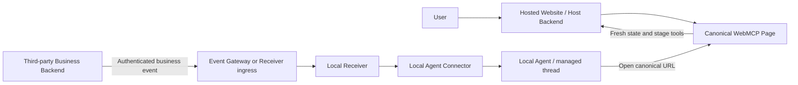
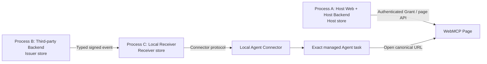

# Distributed Topology and Hard-Coupling Risk Review

**Role:** SUPPORTING reference opinion and architecture review  
**Status:** Advisory; risk findings remain useful, but topology, sequencing, correlation,
durability, and product-test priorities are partially superseded by Research 07–12  
**Observed:** 2026-08-30  
**Scope:** P0 implementation topology, distributed-deployment seams, security boundaries, reliability, and hardcoded coupling

> **Partial supersession notice:** Use this document for its distributed-boundary and
> failure-mode findings. Do not use its original recommendation to build the three-process
> harness immediately, or its original correlation-mismatch treatment, without the
> adjudication in [Research 07](07-supported-reentry-transport-and-heartbeat-spike.md),
> [Research 08](08-review-05-adjudication-and-p1-trust-delivery-plan.md), and the active
> ordering in [Research 10](10-post-h1-unknowns-and-validation-roadmap.md). Use
> [Research 11](11-platform-durability-and-cold-start-audit.md) for current durability
> treatment and [Research 12](12-product-value-kill-test-preregistration.md) for product
> substitution tests.

## Executive conclusion

The current P0 is a valid disposable technical-composability harness, but it is not yet a
proof of the intended distributed deployment topology. H2 later proves a crash-recoverable
enrollment service contract against a separate synthetic durable destination; that narrows
one concrete dual-write risk without selecting or proving the production topology.

The harness intentionally collapses several real boundaries into one local runtime:

- the fixture Host Web application, workflow domain, Grant service, and Receiver event
  handler are constructed by one Node runtime;
- they use one SQLite database and one local HTTP origin;
- the third-party business backend is represented by a test script and an unprotected test
  transition route;
- the Agent continuation path is a same-user, same-machine Desktop relay bound to one
  local task; and
- the page, APIs, Receiver state, and test event path are all reachable through the same
  local process.

This is not a defect in the frozen P0 objective. It is an explicit scope boundary. The
current run proves that the WebMCP re-entry mechanism is technically composable in one
controlled environment. It does not prove that the mechanism survives the trust, network,
identity, delivery, lifecycle, and failure boundaries implied by the real concept.

For a topology that selects a Local Receiver or paired connector, the two highest-risk
unresolved seams are:

1. **Remote business-event delivery to a Local Receiver.** A remote backend cannot reach a
   user's `127.0.0.1` directly. The concept needs an explicit outbound connection,
   polling, WebSocket, relay, or local connector protocol.
2. **Receiver-to-Agent and Browser attachment.** The frozen P0 adapter path relied on a
   private, task-launched Desktop bridge. H0b, H1, and H2a later proved a current-build
   Scheduled same-task route without that bridge, but no supported, portable contract has
   been demonstrated for an independent Receiver to attach to an arbitrary user's existing
   Agent task and its Browser.

The recommended next step is not a broad production rewrite. First run the smallest
supported Agent-transport kill test. If that test selects a local connector topology, then
build a bounded **distributed seam harness** with three logical processes, separate stores,
network-only contracts, and failure injection. The existing P0 remains the composability
baseline.

## 1. Evidence discipline and source boundary

This review uses the following labels:

- **VERIFIED:** directly supported by the current repository code, current P0 evidence, or
  an existing project document.
- **WORKING ASSUMPTION:** intentionally selected for the disposable fixture or currently
  used to make the test deterministic.
- **INFERENCE:** a consequence expected when the local fixture is split into the intended
  deployment topology.
- **UNKNOWN:** not established by the current implementation or evidence.
- **TARGET:** a proposed condition for the next validation harness.
- **DEFERRED:** deliberately outside the frozen P0 scope, not solved.

This document is an advisory review. It does not select the final host application, change
the domain-neutral mechanism, or authorize production claims. Any durable change to the
mechanism, trust model, or MVP boundary requires an ADR and reconciliation with the Core
documents.

Primary project sources:

- [Current project status](../Core/00-current-status.md)
- [Frozen P0 technical validation MVP](../Core/07-p0-technical-validation-mvp.md)
- [System design baseline](../Core/03-system-design.md)
- [Trust, security, and reliability baseline](../Core/04-trust-security-reliability.md)
- [ADR-0004: separate event protocol from Agent runtime transport](../Decisions/ADR-0004-separate-event-protocol-from-agent-transport.md)
- [Current platform bridge decision](04-platform-bridge-decision.md)

## 2. One candidate Local Receiver topology

The following is one candidate topology, not a selected final architecture. A hosted
Receiver, hosted Agent runtime, or Scheduled same-task pull changes some boundaries. A Local
Receiver plus connector has these distinct operational zones:

The exact ownership of the event gateway is still a design choice. The following
responsibilities must nevertheless be explicit:

| Zone | Expected owner | Must not be inferred from the P0 fixture |
|---|---|---|
| Hosted Website | Host application and its backend | The page is not the Receiver and does not own Agent context identity |
| Third-party Backend | External business system or event issuer | It must not be trusted merely because it can call a local test route |
| Local Receiver | User-controlled continuation and Grant authority | It must not depend on direct access to Host or third-party private databases |
| Local Agent Connector | Device-specific Agent and Browser interaction | It must have an explicit identity, lifecycle, and failure contract |

An unresolved authority question must be settled before the distributed harness is treated
as architecture evidence: if the third-party backend owns the business transition while the
Host backend owns the workflow state, which component is authoritative for the event's
`state_version`, authorization, and signature? The current fixture combines the transition
and event intent in one process, so it does not expose this split.

## 3. What the current P0 actually implements

### 3.1 Verified frozen-P0 local topology

The current implementation is intentionally close-coupled:

1. `createRuntime()` constructs the workflow domain, Grant service, event receiver, adapter,
   database, trace, and runtime configuration together in
   [`mvp/src/server.mjs`](../../mvp/src/server.mjs).
2. The default origin is `http://127.0.0.1:4317`, and the default SQLite database is local
   to the fixture in [`mvp/src/config.mjs`](../../mvp/src/config.mjs).
3. The browser page, workflow APIs, Receiver enrollment APIs, event ingress, consent
   surface, and test transition route are all served by the same HTTP server.
4. `trigger-event.mjs` simulates the external business system by reading the local workflow,
   calling `/api/test/transition`, signing the fixture event with a development secret,
   and posting it back to the same server.
5. The Receiver event path resolves Grants and runs from the same database rather than
   crossing an authenticated service boundary.
6. The Desktop adapter can use a separate local Unix-socket relay, but that relay is
   deliberately same-user, same-machine, current-build-specific, and task-bound. It is
   not a hosted Receiver-to-Desktop contract.

The implementation locations are:

- [`mvp/src/config.mjs`](../../mvp/src/config.mjs)
- [`mvp/src/server.mjs`](../../mvp/src/server.mjs)
- [`mvp/src/domain.mjs`](../../mvp/src/domain.mjs)
- [`mvp/src/receiver/grants.mjs`](../../mvp/src/receiver/grants.mjs)
- [`mvp/src/receiver/events.mjs`](../../mvp/src/receiver/events.mjs)
- [`mvp/scripts/trigger-event.mjs`](../../mvp/scripts/trigger-event.mjs)
- [`mvp/src/adapters/desktop-task-adapter.mjs`](../../mvp/src/adapters/desktop-task-adapter.mjs)
- [`mvp/src/relay/codex-app-tools-relay.mjs`](../../mvp/src/relay/codex-app-tools-relay.mjs)

### 3.2 P0 evidence boundary

The current status records one clean correlated Q1-Q5 run and the current test suite as
passing. That evidence supports the following bounded statement:

> In the tested current Desktop runtime, a page exposed genuine Stage-A WebMCP tools,
> Receiver-owned consent created a bounded Grant, one authenticated event reached the same
> local Agent task through the private bridge, the canonical page was reopened, Stage-B
> tools were rediscovered and invoked, and the artifact stopped before the visible commit
> control, which was not exposed as a Site Tool.

It does **not** support these broader statements:

- a remote cloud backend can wake a local Receiver without an explicit connector;
- an independent hosted Receiver can attach to any user's local Desktop task;
- the current private bridge is a supported or stable Codex production API;
- event delivery is crash-recoverable or generally durable;
- exactly-once business effects hold under retries, restarts, or concurrent events;
- public HTTPS, browser session identity, CORS, CSRF, Origin checks, or multi-user isolation
  have been proven; or
- the current single-workflow data model is suitable for a multi-user deployment.

The distinction is consistent with the current status and ADR-0004. The local P0 remains
useful, but its result must not be promoted to distributed deployment evidence.

## 4. Distributed topology risk register

Severity is expressed as follows:

- **S0 — architecture blocker:** the concept cannot operate in the intended topology until
  this seam has a viable design and a passing test.
- **S1 — release-critical:** the happy path may work, but security, correctness, or
  recoverability is not credible without this seam.
- **S2 — hardening / scale risk:** not required to re-prove the frozen mechanism, but must
  be addressed before a production or broad multi-user claim.

### R-01 — Remote Backend cannot directly reach a Local Receiver (S0)

**Evidence:** The current event issuer and Receiver are same-origin local HTTP endpoints.
The default origin is loopback, and the trigger script calls the fixture directly.

**Why it matters:** From a remote server, `127.0.0.1` refers to the remote server itself.
There is no network path from an arbitrary third-party backend to a user's laptop behind
NAT, a firewall, or a changing network. A successful local POST therefore says nothing
about real event reachability.

**Recommendation:** Choose and document one explicit channel:

- a Local Receiver that maintains an authenticated outbound connection;
- a polling worker that retrieves event records;
- a WebSocket or comparable long-lived connection;
- a paired local connector with an event gateway; or
- a hosted Agent runtime that removes the local-device boundary.

**Current update:** H0b proved that a same-chat scheduled task can regain the current-build
Browser and Site Tools without a Receiver push into the Agent. It does not let a remote
backend reach a loopback Receiver. H1 therefore treated the schedule as the wake and a
durable accepted event record as the gate; production still needs an explicit reachable
event-ingress topology if a Local Receiver is selected.

**H1 disposition:** The bounded H1 run followed that model and passed locally. This confirms
the schedule/event separation, but it does not change the remote-to-loopback network fact or
select a production ingress channel.

**Minimum validation:** Stop the Local Receiver process, start a separate Backend process,
emit an event while the Receiver is unavailable, restart the Receiver, and prove delivery
without a direct shared-database read or loopback shortcut.

### R-02 — Receiver-to-Agent and Browser attachment is a private bridge (S0)

**Evidence:** The current Desktop adapter uses a task ID from `CODEX_SESSION_ID`, a local
Unix-socket relay, fixed task targeting, and `open_in_codex` / `send_message_to_thread`.
The platform-bridge research records that this is an undocumented current-build local
route, not a supported external attach contract.

**Why it matters:** The concept depends on waking the exact managed Agent context and
regaining the page-bound Browser. A Receiver can validate an event perfectly and still fail
if it cannot address the correct task, process, account, workspace, browser, or page.
Context continuity and capability continuity are separate problems.

**Recommendation:** Select one deployment variant explicitly:

1. an Agent-side or Local Receiver with an installed connector;
2. a hosted Receiver paired with a local connector that owns device interaction; or
3. a hosted Agent and Browser runtime.

Do not describe the current private relay as a public platform integration.

**Current update:** The sealed-context H0b probe removed this as a current-build feasibility
blocker for scheduled pull: an existing idle task recovered its prior bounded receipt,
opened a fresh built-in Browser tab, and invoked a genuine page-bound Site Tool without the
private relay. The risk remains S0 for a production claim because this behavior is not an
official unattended-Browser compatibility contract and has not passed restart, clean-room,
busy-task, or multi-account tests.

**H1 disposition:** One scheduled current-build run has now exercised the full gated path
through fresh genuine Receiver and Host Site Tools, including acknowledgement-loss retry.
R-02 therefore remains S0 for production compatibility and identity, not for bounded local
composability.

**H2a disposition:** A later trigger-only turn also rebuilt its Browser/WebMCP runtime after
the prior task-scoped Node kernel was terminated. This rules out persistent task-level
JavaScript variables and old Site Tool handles as necessary conditions. The Desktop app and
its parent tool service remained alive, so full app, device, update, and clean-room durability
remain open under [Research 11](11-platform-durability-and-cold-start-audit.md).

**Conditional minimum validation:** If a connector topology is selected, a separately
started Receiver must invoke an explicit connector contract that proves the exact task
identity, opens the bound page, observes the current page-bound WebMCP tools, and fails
closed when the task or browser is unavailable. A Scheduled-pull or hosted-Agent selection
requires a different topology-specific test.

### R-03 — Trust boundary is logical, not physical (S0/S1)

**Evidence:** Grant and workflow data are in one database and are accessed by one runtime.
The current code can keep `managed_context_id` private by convention, but the physical
storage and process boundary is not separate. Host and Receiver routes also live in one
server.

**Why it matters:** In the real topology, Host, third-party Backend, Receiver, and local
connector have different trust levels. A convention that is safe in one process can become
a data leak when a route, database account, log, backup, or operator crosses the boundary.

**Recommendation:** Define separate service identities and stores. The Host must receive
only a workflow-scoped opaque binding and non-sensitive Grant summary. The Receiver must
own raw Agent context mapping. Cross-service operations must use versioned authenticated
protocols rather than shared SQL tables or direct service imports.

**Minimum validation:** Run Host and Receiver with separate databases and credentials;
make every cross-boundary operation an authenticated request; prove that Host APIs and
logs cannot retrieve the raw managed context or Agent task identifier.

### R-04 — External-fact authority and Host workflow-state authority need a contract (S1)

**Evidence:** The fixture's deterministic transition changes workflow state and creates
event intent within one domain runtime. The third-party issuer is only a local test script.

**Why it matters:** In a real integration, an external system may authoritatively report a
business fact, while the Host backend owns workflow state, artifact state, and
`state_version`. A valid external signature cannot authorize an external party to assert
Host workflow truth.

**Recommendation:** Define field-level authority. The external system may sign its bounded
fact or callback. The Host validates and reconciles that fact, performs the Host-side state
transition, and emits the versioned event intent consumed by the Receiver. If the Host
cannot validate the external fact, it must not advance workflow state or wake the Agent.

**Minimum validation:** Send a correctly signed external fact that is stale, duplicated,
or not mapped to an authorized Host transition; prove that the Host emits no new state
version or continuation event.

### R-05 — Event delivery has no durable distributed retry contract (S1)

**Evidence:** The frozen P0 adapter event path reserves a run and increments the Grant budget
before synchronously calling `adapter.resumeContext()`. An adapter failure marks the run
and event failed; there is no outbox worker, lease, retry state, or recovery path in that
P0 path. H1 uses a different local heartbeat path that atomically persists an event, run,
and Inbox delivery without synchronous adapter dispatch.

**Why it matters:** A process crash, network timeout, connector restart, or temporary
Browser unavailability can occur after reservation and before the Agent receives the wake.
If the run is terminal at that point, a legitimate event is lost. If a sender retries
without idempotency, the Agent may be woken twice.

**Recommendation:** Use an explicit delivery state machine and at-least-once transport
with idempotent effect handling. Persist accepted events, leases, attempts, backoff,
acknowledgement, and dead-letter outcomes. Keep `event_id`, Grant, sequence, and workflow
version checks at the Receiver boundary.

**Minimum validation:** Inject failures after event acceptance, after run reservation,
before connector dispatch, after connector dispatch, and after page re-entry. Restart each
component and prove one eventual effect, no duplicate continuation, and an inspectable
failure state.

**H1 disposition:** The local H1 experiment now covers Receiver restart after acceptance,
one deliberately lost acknowledgement, exact event replay, and one Host effect ledger entry.
It does not cover separate stores, network partitions, leases, backoff, dead-letter handling,
multiple events, or connector restart. R-05 is narrowed but remains open for any distributed
or production claim.

**H2 disposition:** The enrollment-receipt path now proves a stable outbox dispatch ID,
bounded lease compare-and-swap, an idempotent separate SQLite destination, and recovery from
destination and Receiver acknowledgement-loss crash boundaries. This is not the business-
event delivery path and does not prove the future remote Host, Receiver, connector, or Agent
transport.

### R-06 — Cross-origin authentication and browser session behavior are untested (S1)

**Evidence:** The fixture uses one local origin, a correlation header, and no production
session, CORS, CSRF, Origin, or TLS contract. The browser client stores the correlation ID
in `sessionStorage`.

**Why it matters:** A hosted page, an external Receiver, and a third-party Backend will
have different origins and authentication contexts. A correlation ID is not a user
identity. Without explicit origin and session binding, another page or browser session may
register or invoke against the wrong workflow.

**Recommendation:** Define the Host user/session identity, Receiver service identity,
issuer identity, and anti-CSRF model separately. Use HTTPS in the deployment shape, strict
Origin validation where applicable, explicit CORS only where necessary, and server-side
authorization rather than a client-generated correlation header.

**Minimum validation:** Run the Host page and Receiver on distinct origins, test a valid
session, a different user session, a forged Origin, a missing CSRF proof, and a replayed
correlation ID. Confirm that only the intended workflow can register and continue.

### R-07 — Canonical URL is not sufficient page or tab identity (S1)

**Evidence:** The current relay fixes one canonical URL and opens it in the target task.
The global fixture has one workflow and does not model multiple tabs, sessions, or
concurrent re-entry attempts.

**Why it matters:** A URL identifies a route, not a page instance. Multiple tabs, stale tabs,
different users, redirects, or an already-open page can cause the Agent to act on the wrong
session or artifact. Re-entry must be correlated to the authorized page context, not just a
string URL.

**Recommendation:** Bind the Grant to an allowlisted origin and workflow plus a short-lived
re-entry nonce or page-instance identifier. The page should prove current authenticated
identity and workflow ownership before accepting the opaque binding. The Agent must read
fresh state after navigation and reject unexpected identity or stage.

**Minimum validation:** Open two tabs and two user sessions for the same route; deliver an
event for one binding; prove that only the intended page/session exposes the continuation
surface and that the other tab remains unaffected.

### R-08 — Grant activation and binding registration have a timing race (S1)

**Evidence:** Grant approval first persists an `ACTIVATING` Grant and dispatches a
continuation receipt. The Grant becomes `ACTIVE` after that dispatch returns. Host binding
registration is a later operation. The current reliability document records this race as
an observed design boundary, although the clean run did not hit it.

**Why it matters:** A fast page or event can observe an incomplete enrollment state. A
binding request may arrive before activation, or an event may arrive before the task has
stored the receipt. The result can be a false rejection, a lost event, or an inconsistent
Grant/binding pair.

**H2 disposition:** The historical heartbeat path still has the gap described above, but
the additive H2 service contract closes it without changing H1. One transaction persists a
non-active Grant, Inbox, and receipt outbox; a stable dispatch ID and idempotent separate
destination recover from acknowledgement loss; and activation waits for both durable receipt
delivery and exact Host binding. Real process termination at four commit boundaries and two
independent approval processes passed. See the
[H2 verdict](../../mvp/evidence/h2-durable-enrollment-service-contract-2026-08-30-verdict.md).

The remaining production risk is destination-specific: a real Desktop, hosted Agent, or
connector must provide the same durable acknowledgement and idempotency contract, with
supervision, identity, key lifecycle, retention, revocation, and multi-tenant isolation.

**Recommendation:** Make enrollment a small state machine with explicit activation and
registration acknowledgements. Either complete the required receipt persistence before
publishing an active Grant, or make registration and first delivery safely idempotent while
the Grant is pending.

**Minimum validation:** Add artificial delays at each approval, receipt, activation, and
binding boundary. Prove deterministic behavior for early binding, early event, duplicate
approval, and retry.

### R-09 — Development credentials and issuer trust are not production lifecycle controls (S1)

**Evidence:** The fixture uses fixed development HMAC secrets, a fixed manifest key ID, a
   pinned local origin, and no general key registry, rotation, or issuer onboarding flow.

**Why it matters:** Shared static secrets do not provide tenant isolation, rotation,
revocation, least privilege, or useful attribution when services are deployed separately.
Compromise of one fixture secret can authorize all synthetic events.

**Recommendation:** Treat development keys as fixture-only. Define service authentication,
per-issuer or per-installation keys, key IDs, rotation, revocation, and secret storage
before making a public deployment claim. Prefer an authenticated service channel plus a
detached event signature where independent event verification is required.

**Minimum validation:** Rotate an issuer key without downtime, reject an old revoked key,
and prove that a key for one workflow or installation cannot authorize another.

### R-10 — Single-workflow and single-binding data model hides isolation failures (S2)

**Evidence:** `WF-001` is fixed in configuration, domain logic, browser client, and routes.
The domain seeds one workflow, one artifact, one event type, one sequence, and one binding
per workflow. Reset deletes all fixture rows and reseeds the same workflow.

**Why it matters:** These choices are good for deterministic P0 evidence but hide tenant,
user, workflow, concurrent Grant, and multiple-event behavior. A binding replacement that
is harmless for one workflow may attach the wrong Agent in a multi-user system.

**Recommendation:** Keep the synthetic values in P0, but move identity and scope to
configuration boundaries in the next harness: tenant or installation, authenticated user,
workflow instance, Grant, page instance, and event sequence. Do not generalize every
domain feature yet; generalize only the identity and isolation seams.

**Minimum validation:** Run two independent workflows and two users concurrently and
prove that manifests, bindings, events, artifacts, and Agent contexts cannot cross.

### R-11 — Site Tool inventory and schema compatibility are under-specified across re-entry (S2)

**Evidence:** The fixture derives tool names from local workflow state and registers them
on the page. P0 now proves same-document state reconciliation and registration removal with
`AbortSignal`; H1 and H2a prove fresh-page rediscovery. The Host, page, Agent, and adapter
are still not version-negotiated components.

**Why it matters:** A deployed page may update between enrollment and re-entry. A tool may
be renamed, removed, or change its schema while the Grant remains valid. An Agent may also
retain stale context about a previous tool surface.

**Recommendation:** Add a page/tool-surface version or capability hash to the authoritative
page state. The Agent must re-discover current tools and use only the current stage. The
Receiver must not grant tools; it should carry only bounded intent and scope.

**Minimum validation:** Enroll on one page version, deploy a compatible and an incompatible
tool-surface change, and prove that stale or unknown tools are not invoked.

### R-12 — Human commit boundary is fixture-level authorization (S2)

**Evidence:** The current commit route is protected by a visible human UI and an
`X-Human-Action: true` request header. There is no selected domain's user role, step-up
authentication, approval record, or audit policy in the generic fixture.

**Why it matters:** A header is not durable proof of who approved a consequential action.
This is acceptable for a domain-neutral P0 boundary but not for a product or regulated
workflow claim.

**Recommendation:** Keep commit outside Agent-callable Site Tools. After selecting the
host application, define the human actor, authorization, confirmation UX, audit record,
and any step-up requirement in a domain-specific security overlay.

**Minimum validation:** The Agent can continue and prepare work, but only an authenticated
human with the required role can commit, and the decision is recorded with correlation and
artifact revision.

### R-13 — Local connector lifecycle and ownership are not yet a deployment contract (S2)

**Evidence:** The current relay uses a task-launched process, an environment-supplied task
ID, an ephemeral bearer, and a Unix socket. The relay verifies socket mode and owner, but
does not itself create or enforce the parent directory boundary. The exact Desktop host
validation behavior is undocumented.

**Why it matters:** A real local connector needs installation, upgrade, startup, shutdown,
pairing, revocation, crash recovery, version compatibility, and user-visible status. A
socket that works in one task ancestry is not automatically a safe long-lived service.

**Recommendation:** If the local topology is selected, define the connector as an explicit
product component with a lifecycle and pairing protocol. Keep private Desktop probing as
diagnostic evidence only.

**Minimum validation:** Install and start the connector independently, pair it to one user
and one Receiver, revoke the pair, restart it, and prove that an old bearer or another
local user cannot control the task.

### R-14 — Observability and clock assumptions do not yet cover distributed operation (S2)

**Evidence:** The fixture has bounded traces and correlation IDs, which is useful P0
evidence. The distributed shape introduces independent clocks, queues, proxies, retries,
and service logs that the current single-process trace does not model.

**Why it matters:** Without durable trace propagation, monotonic event sequence handling,
clock-skew policy, and attempt records, it becomes difficult to distinguish a duplicate,
stale event, lost delivery, connector failure, or wrong-page attachment.

**Recommendation:** Standardize a trace envelope containing correlation ID, Grant ID,
event ID, run ID, attempt ID, workflow ID, state version, and actor/service identity.
Record accepted, rejected, queued, dispatched, acknowledged, resumed, re-entered,
continued, failed, and dead-lettered states without storing secrets or raw platform
credentials.

**Minimum validation:** Trace one event across all three processes, restart one process,
and reconcile the final state from independent logs and stores.

## 5. Hardcode and strong-coupling audit

The following table distinguishes acceptable P0 controls from coupling that must not be
mistaken for production architecture.

| Current coupling | P0 classification | Architectural concern | Recommended treatment |
|---|---|---|---|
| `WF-001` | Intentional fixture control | No workflow or tenant isolation | Keep in P0; inject workflow identity in the next harness |
| `127.0.0.1:4317` and HTTP | Intentional fixture control | No remote reachability, TLS, or cross-origin behavior | Keep for local P0; test distinct origins and HTTPS-like deployment next |
| One Node runtime for Host and Receiver | Intentional fixture control | No process, trust, or failure boundary | Keep frozen; split processes for seam validation |
| One SQLite database | Intentional fixture control | Shared SQL hides protocol and data-isolation failures | Use separate stores and service identities in the seam harness |
| Fixed manifest and event HMAC secrets | P0-only development control | No rotation, revocation, or tenant isolation | Replace with managed, scoped credentials before deployment claims |
| `/api/test/transition` | Test-only control | Unauthenticated route is not an external backend contract | Keep test-only and exclude from production surface |
| `GET /api/workflows/WF-001` returns full opaque binding | Fixture shortcut / security risk | A browser or caller can retrieve a value intended to be scoped and opaque | Return only the minimum page-safe summary; resolve binding server-side |
| Fresh-page correlation can differ from Grant correlation | Observability behavior, not authorization | Treating a trace ID as identity would break legitimate new-page registration | Use a one-time registration capability bound to subject, workflow, origin, Grant, and expiry; keep correlation diagnostic-only |
| `CODEX_SESSION_ID` selects the Agent task | Local diagnostic control | Environment identity is not a portable enrollment or pairing contract | Replace with connector-owned verified task identity |
| Prompt-prefix constrained relay calls | Diagnostic transport control | Natural-language prefixes are brittle as a long-term protocol | Use a versioned structured adapter command contract |
| Event sequence effectively fixed at `1` | Single-event fixture control | Ordering and concurrent event behavior are untested | Add workflow-scoped monotonic sequence and stale-event handling |
| One host binding per workflow | Single-user fixture control | Binding replacement can cross users or tabs | Scope binding by Grant, user/session, page instance, and workflow |
| Synchronous adapter dispatch | P0 happy-path control | Crash, retry, queue, and acknowledgement semantics are absent | Add durable delivery state and idempotent connector dispatch |
| Run budget consumed before adapter success | P0 reliability limitation | A failed dispatch can permanently consume the only run | Define reservation, lease, retry, and exhaustion semantics |
| `X-Human-Action: true` | Fixture human boundary | Header is not identity or durable approval evidence | Keep UI-only Agent boundary; add domain authorization later |
| Global reset that deletes and reseeds fixture rows | Deterministic test control | Not a production lifecycle or recovery model | Keep in test tooling; never use as operational recovery |

The presence of a hardcode is not by itself a P0 defect. The decision question is whether
the value is a disposable test control or an accidental authority, trust, identity, or
transport dependency.

## 6. Conditional next validation: distributed seam harness

### 6.1 Preserve the frozen P0

Do not broaden the current P0 until its clean evidence is archived and reproducible. It is
the reference proof for page-bound WebMCP composability. The next harness should be additive
and should not silently replace genuine Stage-A or Stage-B Site Tool evidence with REST,
DOM automation, generic MCP, or a headless substitute.

### 6.2 Three-process shape

Build the smallest environment that introduces the real boundaries:

Required constraints:

1. Host, third-party Backend, Receiver, and connector run as separate processes, even if
   they initially share one development machine.
2. Host and Receiver use separate databases. The third-party Backend has no direct SQL
   access to either store.
3. Cross-boundary operations use network or connector messages only; no direct imports of
   the other service's domain or Grant store.
4. The Host page receives only a page-safe Grant summary and opaque binding operation.
5. The Receiver is the only component that stores the raw Agent context mapping.
6. The connector exposes an explicit versioned contract for identity verification, wake,
   canonical-page open, and result acknowledgement.
7. The event issuer, state authority, and signature authority are recorded in the test
   metadata rather than assumed from process location.

### 6.3 Failure injections

The harness should deliberately exercise these boundaries:

- Backend emits while the Receiver is offline.
- Receiver accepts an event and crashes before connector dispatch.
- Connector dispatches and crashes before acknowledgement.
- Sender retries the same `event_id` and sends an out-of-order sequence.
- Grant expires or is revoked during delivery.
- Binding registration uses the wrong correlation, user session, origin, or page nonce.
- The exact Agent task is missing, belongs to another user, or is already busy.
- The canonical page is closed, redirected, stale, authenticated as another user, or open
  in multiple tabs.
- The page tool surface changes between enrollment and re-entry.
- Host state is stale or conflicts with the event's state version.

The objective is not to implement every production edge case. These tests are the minimum
seams needed to distinguish a real architecture from a single-process happy-path illusion.

## 7. Proposed pass criteria before a stronger architecture claim

The distributed concept should not be described as technically deployable until all of the
following are demonstrated:

1. A separately deployed or separately simulated business backend can deliver an
   authenticated event through the chosen channel to a Local Receiver without loopback
   access or shared database access.
2. The Receiver can prove and address the exact Agent context through an explicit,
   user-owned connector contract.
3. The Host and Receiver exchange only versioned, authenticated, minimum-necessary data;
   the Host cannot retrieve raw Agent context identity.
4. Receiver restart, connector restart, duplicate delivery, and retry produce one
   idempotent continuation effect or a clearly inspectable dead-letter outcome.
5. Binding and event checks reject wrong workflow, user, session, origin, Grant, event type,
   sequence, or state version before Agent wake.
6. Re-entry reaches the intended authenticated page instance, re-reads authoritative state,
   re-discovers current genuine WebMCP tools, and refuses stale or incompatible tools.
7. The selected product enforces its human consequence through authenticated action
   authority outside the re-entry Grant, with a defined actor and audit record.

If item 1 or item 2 fails, the appropriate conclusion is not that the Grant/event concept
failed. It is that the chosen deployment variant needs a local connector or a hosted Agent
runtime. The mechanism and the Agent transport must remain separate decisions.

## 8. Decisions the main thread should make next

The main thread should resolve these questions before production-oriented refactoring:

1. **Deployment variant:** local/Agent-side Receiver, hosted Receiver plus local connector,
   or hosted Agent and Browser.
2. **Event path:** direct Receiver ingress, hosted gateway with outbound local connection,
   polling, or another explicit transport.
3. **Business authority:** Host backend versus third-party Backend for state transition,
   state version, and event signature.
4. **Binding lifecycle:** H2 supplies the bounded activation and early-event contract; the
   selected real destination must still supply authenticated acknowledgement, replacement,
   revocation, retention, and recovery behavior.
5. **Delivery semantics:** at-least-once delivery with idempotent effects, retry and
   dead-letter behavior, and whether any stronger exactly-once claim is actually required.
6. **Agent identity:** how a connector proves the exact task, user, workspace, and Browser
   context without trusting an environment variable or prompt text.
7. **Page identity:** how re-entry binds to the correct authenticated page/session/tab and
   rejects a stale or different context.
8. **Claim boundary:** what is demonstrated as a project-owned protocol, what is a
   platform-specific adapter, and what remains a private diagnostic bridge.

These are architecture choices, not reasons to add unrelated product features to the P0.

## 9. Non-goals for this review

This document does not:

- select TenderRelay or any other final application domain;
- modify the immutable TenderRelay dossier or architecture image;
- change the five frozen P0 feasibility questions;
- claim a public Codex integration or stable Desktop API;
- require multi-tenant enterprise administration before the next seam test;
- require a production-grade broker when a durable outbox and small connector queue are
  sufficient; or
- replace genuine page-bound WebMCP evidence with generic automation.

## 10. Bottom-line recommendation

Keep P0/H1/H2a as current-build mechanism evidence and H2 as a bounded enrollment-service
contract. Treat this review as a conditional production-risk catalog, not the active roadmap.
Run the smallest independent genuine-WebMCP discovery smoke, select a product layer and app
from observed workflow evidence, and run the product substitution tests before selecting a
transport. Only then build the smallest topology-specific distributed seam; build a local
connector harness only if that transport is actually selected.
