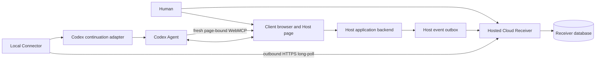

# Cloud Receiver and Local Connector MVP Plan

**Role:** SUPPORTING proposed implementation plan and pre-ADR decision input  
**Status:** Proposed; no production topology, wire contract, host application, or Agent adapter is selected by this report  
**Prepared:** 2026-08-30, Europe/London  
**Planning baseline:** `codex/mvp2-tenderrelay` at `fab956e3a64c3bc127016266e45441c844e6906d`; current canonical `origin/main` inspected at `6736abe`  
**Primary constraint:** Prove one secure, understandable happy path without building a universal platform  

## 0. Executive decision

The proposed real-world mechanism is feasible, but it must be split into two independently
trusted runtime components:

1. a **hosted Cloud Receiver** that authenticates websites, owns user-approved Grants,
   durably retains pending deliveries, and maps each delivery to its owner; and
2. a **Local Connector** that makes an outbound authenticated connection from the user's
   machine, receives only the deliveries assigned to that machine, and asks an approved Codex
   adapter to resume the bounded workflow in a WebMCP-capable browser.

The Cloud Receiver is the control and durability authority. The Local Connector is an
execution bridge. The Host application remains the authority for business state and every
business effect. Codex remains the reasoning and page-action layer. None of these components
inherits the authority of another component.

The smallest acceptable implementation is:

```text
one registered Host website
  -> one signed Manifest
  -> one user approval
  -> one active Grant
  -> one later signed event
  -> one durable pending delivery
  -> one paired Local Connector
  -> one bound Codex context
  -> one canonical page re-entry
  -> one current WebMCP read
  -> one visible draft update
  -> one human-only final action
```

This report does not recommend direct inbound webhooks to a user's machine, a permanent Codex
Heartbeat, a multi-service cloud deployment, a general policy engine, or production-grade
multi-tenancy for the first implementation.

The highest-risk dependency is not the Cloud Receiver. It is the final supported join from a
Local Connector to an eligible Codex context, browser, and genuine page-bound WebMCP surface.
The tested standalone App Server joins failed in the current build, and `codex queue` has shown
enqueue behavior without proving dormant-task wake. That last mile must pass a bounded kill test
before the team invests in a complete hosted platform.

## 1. Objective, constraint, and success condition

### 1.1 True objective

Allow a person to approve one narrow future continuation while they are using a normal web
application, then allow one later authoritative website event to bring the person's Agent back
to the correct live page, current state, and current WebMCP tools without asking for the same
permission again.

### 1.2 Binding constraint

Time is limited. The first implementation must prove the complete security and delivery chain,
not the breadth of a general cross-site platform.

### 1.3 Highest-leverage action

Prove the Local Connector-to-Codex-to-Browser/WebMCP join first with one synthetic cloud inbox
item. If that join cannot be made reliable enough for the intended demo topology, stop and select
a different Agent runtime adapter before building the hosted Receiver.

### 1.4 Happy-path success condition

One clean correlated run must prove all of the following:

1. a Host backend creates a signed Manifest for one workflow and one later event;
2. the correct signed-in human approves it through a Receiver-owned permission surface;
3. the Cloud Receiver creates one narrow non-active Grant bound to one paired Connector;
4. the Host stores only an opaque continuation binding and acknowledges that exact binding;
5. the Receiver activates the Grant only after the Host-binding acknowledgement;
6. the Host later commits a business-state transition and an event intent together;
7. the Cloud Receiver authenticates and durably records one pending delivery;
8. the Local Connector retrieves the delivery without exposing a public local port;
9. the Connector activates the intended Codex context through the selected adapter;
10. Codex opens the allowlisted canonical page and reads fresh state through genuine WebMCP;
11. Codex updates one visible draft through a stage-valid WebMCP tool;
12. Codex cannot invoke the final human-only action;
13. a correlated signed Host effect receipt acknowledges the delivery; and
14. exact event or delivery replay creates no second Host effect.

## 2. Corrections to the working mental model

### 2.1 The Agent does not grant itself future authority

An Agent may invoke a WebMCP tool that starts or updates a business workflow. The Host backend,
not the Agent, decides whether that workflow has a legitimate future re-entry point and creates
the signed Manifest.

```text
Agent invokes a current Site Tool
  -> Host applies current business rules
  -> Host may create a signed future re-entry offer
```

The Manifest is an offer. It is not a Grant and does not authorize a future run.

### 2.2 The browser does not become the authority

The browser displays the offer and carries the human's approval action, but the Cloud Receiver
must independently verify the exact signed Manifest, signed-in user, selected Connector, expiry,
event type, canonical URL, and requested limits before creating a Grant.

A caller-supplied boolean such as `humanApproved: true` is not sufficient evidence of approval.

### 2.3 The Cloud Receiver is a logical authority and a deployed service

For the selected proposed topology, the Cloud Receiver is hosted because it must accept events
while the user's machine is offline. It does not replace the Host application's database or
business rules. It stores only continuation authority, delivery state, and bounded audit data.

### 2.4 The local process is a Connector, not a second authority

The local process may be described informally as a mini Receiver, but its correct role is Local
Connector. It does not issue Grants, accept arbitrary website instructions, or decide that a
revoked Grant is still valid. It pairs a device, retrieves a short-lived delivery lease, invokes
one Agent adapter, and returns status or effect evidence.

### 2.5 Prior approval is narrow, not permanent

Codex does not ask for the same approval again when the later event exactly matches an active
Grant. A new approval is still required when:

- the Grant expired, was revoked, or exhausted its run budget;
- the website, workflow, canonical URL, event type, or Connector changes;
- the Host requests wider permissions;
- the user must recover authentication or MFA; or
- the requested action crosses the declared human decision boundary.

Reading current state and preparing a draft may be automatic. Submission, publication, payment,
deletion, legal commitment, or another selected consequence remains human-controlled.

### 2.6 The Cloud Receiver must not infer ownership from a URL

The Receiver needs a stable opaque continuation binding created during enrollment. The Host stores
that binding with its workflow and sends it with the later event. The Host must not select a raw
Connector ID, Codex task ID, or arbitrary Receiver `owner_id` in the event.

## 3. Proposed deployment topology



### 3.1 Client browser and Host page

Owns:

- the normal human user interface;
- the current authenticated Host session;
- page-bound WebMCP Site Tools derived from current Host state;
- the visible artifact or draft;
- the re-entry offer in domain language; and
- the human-only final action.

Does not own:

- Agent platform credentials;
- Receiver signing keys;
- Connector credentials;
- private Codex context identifiers; or
- authority to self-approve a Grant.

### 3.2 Host application backend

Owns:

- user and tenant authorization for the business workflow;
- authoritative workflow state and artifact revision;
- canonical workflow URL;
- event semantics;
- transactional state transition and event intent;
- WebMCP mutation validation; and
- the final human decision and business receipt.

The Host integrates through a small Host SDK. It does not import Cloud Receiver control logic.

### 3.3 Hosted Cloud Receiver

Owns:

- website/issuer registration for the MVP;
- Manifest verification and storage;
- Receiver-owned human permission UI;
- Grant creation, expiry, revocation, and run budget;
- opaque continuation binding resolution;
- event authentication, scope validation, and deduplication;
- a durable pending-delivery ledger;
- Connector identity and pairing;
- delivery leases, retry-safe acknowledgement, and terminal status; and
- bounded redacted audit records.

The Cloud Receiver does not own or copy the Host's full business artifact.

### 3.4 Local Connector

Owns:

- one paired device identity;
- secure local storage of the Connector credential and private Agent binding;
- outbound retrieval of pending deliveries;
- local duplicate suppression;
- selection of the configured Codex adapter;
- bounded instruction construction from typed data;
- status and effect acknowledgement; and
- visible local health diagnostics.

It should run as an ordinary foreground command for the first proof. Automatic login startup,
installer packaging, auto-update, and cross-platform support are deferred.

### 3.5 Codex continuation adapter

Owns the platform-specific last mile:

- selecting or resuming the intended managed Agent context;
- passing a bounded re-entry capsule rather than an arbitrary website prompt;
- acquiring an eligible browser context;
- opening the canonical URL;
- waiting for current page-bound WebMCP tools;
- enabling Codex to read current state and perform the allowed draft action; and
- returning observable adapter and effect status.

This adapter is replaceable. The Cloud Receiver protocol must not depend on a raw Codex thread ID
or one undocumented queue command.

## 4. Trust and authority boundaries

Authority is conjunctive. A continuation may proceed only when every required condition is true:

```text
registered Host issuer
+ authentic signed event
+ exact opaque continuation binding
+ active user-approved Grant
+ matching Host origin and canonical URL
+ matching workflow and event type
+ valid time window and remaining run budget
+ delivery assigned to the paired Connector
+ authenticated current Host user on re-entry
+ current Host state still permits the action
+ expected artifact revision still matches
```

Failure of any condition stops before a Host mutation.

### 4.1 Host-to-Receiver boundary

The Host is trusted only for its registered issuer identity and signed typed event. It is not
trusted to choose a user's Connector, Codex context, Grant scope, or Receiver owner record.

### 4.2 Browser-to-Receiver boundary

Website content is untrusted. The Cloud Receiver permission screen must display normalized scope
from the verified Manifest and Receiver policy, not simply render arbitrary Host HTML.

### 4.3 Receiver-to-Connector boundary

The Connector accepts deliveries only over an authenticated outbound channel from its configured
Receiver. Delivery data is typed, expires, and is bound to one Connector and Grant. No raw prompt
field is allowed.

### 4.4 Connector-to-Codex boundary

The Connector never passes shell commands, website-supplied instructions, credentials, or the full
webhook payload to Codex. It constructs a fixed instruction from approved fields and the stored
Grant receipt.

### 4.5 Codex-to-Host boundary

Codex obtains authority only through the current authenticated page and current WebMCP Site Tools.
An event or Connector instruction cannot authorize a business mutation by itself.

## 5. Minimal protocol objects

The names and field spelling below are proposed planning examples. The wire format must be frozen
through a protocol ADR before implementation because MVP1 and MVP2 currently use incompatible
contracts.

### 5.1 Connector registration

Purpose: bind one user account to one local machine without exposing Agent context to a Host.

Minimum data:

```json
{
  "connector_id": "lc_...",
  "owner_subject": "user_...",
  "device_label": "Alex's Mac",
  "platform": "macos",
  "status": "active",
  "paired_at": "...",
  "last_seen_at": "..."
}
```

The high-entropy bearer credential remains on the machine. The Cloud Receiver stores only a
protected credential digest. A device key pair and proof-of-possession protocol can be added after
the first happy path if the threat model requires it.

### 5.2 Re-entry Manifest

Purpose: let a Host propose one legitimate future event without granting it.

Minimum data:

```json
{
  "manifest_version": "1",
  "manifest_id": "rm_...",
  "issuer_origin": "https://host.example",
  "workflow_type": "reference_workflow",
  "workflow_id": "W-123",
  "current_state": "draft",
  "state_version": 4,
  "artifact_revision": 2,
  "canonical_url": "https://host.example/workflows/W-123",
  "allowed_event_type": "workflow.follow_up_requested",
  "purpose": "Return to prepare a response to later feedback",
  "requested_expires_at": "...",
  "requested_max_runs": 1,
  "human_boundary": "final_submission",
  "issued_at": "...",
  "key_id": "..."
}
```

The signature is detached and covers the exact raw body plus a timestamp. Descriptive text is
untrusted display content and does not expand scope.

### 5.3 Approval challenge

Purpose: prove that the Receiver, not the website, showed the verified scope to the signed-in user.

Minimum data:

```json
{
  "challenge_id": "ch_...",
  "manifest_id": "rm_...",
  "owner_subject": "user_...",
  "connector_id": "lc_...",
  "status": "pending",
  "expires_at": "..."
}
```

The user action changes the challenge to `approved` or `declined`. A hidden API caller cannot set
an unverified approval boolean on behalf of the user.

### 5.4 Continuation Grant

Purpose: record the exact future authority the user approved.

Minimum data:

```json
{
  "grant_id": "cg_...",
  "continuation_binding": "ab_opaque_...",
  "owner_subject": "user_...",
  "connector_id": "lc_...",
  "issuer_origin": "https://host.example",
  "workflow_type": "reference_workflow",
  "workflow_id": "W-123",
  "canonical_url": "https://host.example/workflows/W-123",
  "allowed_event_type": "workflow.follow_up_requested",
  "human_boundary": "final_submission",
  "expires_at": "...",
  "max_runs": 1,
  "runs_reserved": 0,
  "status": "active"
}
```

The Cloud Receiver separately stores the private Connector and Agent binding. The Host receives
only `continuation_binding` plus a signed enrollment receipt. The example shows the final active
record; immediately after human approval its status is `awaiting_host_binding` until the exact
Host acknowledgement is verified.

### 5.5 Continuation Event

Purpose: report one later authoritative Host transition without turning it into an Agent prompt.

Minimum data:

```json
{
  "event_version": "1",
  "event_id": "ce_...",
  "idempotency_key": "host-event-...",
  "continuation_binding": "ab_opaque_...",
  "issuer_origin": "https://host.example",
  "workflow_type": "reference_workflow",
  "workflow_id": "W-123",
  "event_type": "workflow.follow_up_requested",
  "event_sequence": 1,
  "state_version": 5,
  "canonical_url": "https://host.example/workflows/W-123",
  "occurred_at": "...",
  "data": {
    "follow_up_id": "F-1"
  }
}
```

There is no `prompt`, `instruction`, free-form command, raw task ID, or Receiver owner ID.

### 5.6 Delivery lease

Purpose: let one Connector claim pending work without losing it if the Connector crashes.

Minimum data:

```json
{
  "delivery_id": "dl_...",
  "event_id": "ce_...",
  "grant_id": "cg_...",
  "connector_id": "lc_...",
  "lease_token": "one-time-secret",
  "lease_expires_at": "...",
  "attempt": 1,
  "canonical_url": "https://host.example/workflows/W-123",
  "event_type": "workflow.follow_up_requested",
  "workflow_id": "W-123"
}
```

The lease token is a bearer capability and must never appear in public logs or checked-in evidence.

### 5.7 Delivery acknowledgement

Purpose: distinguish receipt, Agent activation, Host effect, and human waiting state.

Minimum states:

```text
claimed
agent_started
awaiting_human
completed
failed_retryable
failed_terminal
```

Minimum final acknowledgement data:

```json
{
  "delivery_id": "dl_...",
  "status": "awaiting_human",
  "adapter_run_id": "local-redacted-reference",
  "host_effect_receipt_id": "effect_...",
  "observed_state_version": 5,
  "observed_artifact_revision": 3,
  "completed_at": "..."
}
```

The Receiver must not convert `queued` or `agent_started` into `completed`.

## 6. Complete happy path

### Phase 0 — One-time Connector pairing

1. The user starts the Local Connector manually.
2. The Connector generates one high-entropy pairing request.
3. The Connector displays a short pairing code and a Cloud Receiver URL.
4. The user opens that URL and signs in to the Cloud Receiver.
5. The user confirms the device name.
6. The Cloud Receiver binds the new `connector_id` to the signed-in user.
7. The Connector receives a long-lived device credential through the pairing exchange.
8. The Connector stores the credential in the macOS Keychain for the first implementation.
9. The Connector registers one local Agent adapter configuration and stores the raw Codex context
   identifier locally only.
10. The Cloud Receiver stores no raw Codex task ID.

Happy-path output:

```text
one active Receiver user
+ one active Connector
+ one private local Codex binding
```

### Phase A — Live Host work and re-entry offer

1. The user opens a Host workflow page in the client browser.
2. The Host authenticates the user and renders current workflow state and artifact revision.
3. The page registers the Site Tools valid for the current stage.
4. Codex discovers the page-bound WebMCP tools.
5. Codex calls a read-only state tool.
6. Codex prepares or updates one visible draft through a revision-guarded Site Tool.
7. The Host persists the draft and returns the new artifact revision.
8. The Host determines that this workflow may require one later follow-up event.
9. The Host backend creates and signs one Re-entry Manifest.
10. The page presents a plain-language offer such as:

```text
If later feedback arrives for this workflow, allow your Agent to return once,
read the current page, prepare a response draft, and stop before final submission.
```

Merely viewing or reading the Manifest creates no Grant.

### Phase B — Human approval and Grant activation

1. The user chooses `Allow later continuation` in the Host page.
2. The page sends the exact signed Manifest to the Cloud Receiver enrollment endpoint or redirects
   to a Receiver-owned approval page with a one-time enrollment reference.
3. The Cloud Receiver authenticates the Receiver user session.
4. The Receiver verifies the Manifest's detached signature, issuer registration, origin, URL,
   workflow, validity window, event type, and limits.
5. The Receiver confirms that the signed-in user has at least one active paired Connector.
6. The Receiver creates a short-lived approval challenge.
7. The Receiver-owned page displays normalized scope:

```text
Website: host.example
Workflow: W-123
Trigger: follow-up requested
Automatic work: read current state and prepare one draft
Human-only action: final submission
Runs: one
Expiry: shown date and time
Device: selected paired Connector
```

8. The user clicks `Approve` on the Receiver-owned page.
9. One Receiver database transaction marks the challenge approved, creates a non-active one-run
   Grant in `awaiting_host_binding`, creates the opaque continuation binding, and records a signed
   enrollment receipt.
10. The browser forwards the signed enrollment receipt to the authenticated Host backend.
11. The Host verifies the Receiver signature and stores only the opaque continuation binding with
    its workflow.
12. The Host returns a signed acknowledgement bound to the exact workflow, Manifest, and opaque
    continuation binding.
13. The Host or browser forwards that acknowledgement to the Cloud Receiver.
14. The Receiver verifies it and changes the Grant from `awaiting_host_binding` to `active`.
15. The Host shows a human-readable `Continuation active` status.

The browser may close and the Codex turn may end after this point.

### Phase C — Waiting

1. The Cloud Receiver keeps the Grant active until expiry, revocation, or its one run is reserved.
2. The Local Connector keeps an outbound long-poll connection to the Cloud Receiver.
3. An empty long poll returns no Agent task and starts no Codex turn.
4. The Host workflow remains authoritative and usable through normal human UI.
5. No business mutation occurs merely because the Grant exists.

### Phase D — Later authoritative Host event

1. A legitimate external actor or system changes the Host workflow later.
2. The Host backend verifies that actor and the business transition.
3. One Host database transaction commits:

   - the new workflow state;
   - the new state version;
   - any external feedback record; and
   - one stable continuation-event outbox row.

4. A small Host outbox relay reads the row and creates the strict typed Continuation Event.
5. The relay signs the exact raw event body with the registered Host credential.
6. The relay sends it to the Cloud Receiver event-ingress endpoint with timestamp, key ID, and
   signature headers.
7. If the Receiver cannot durably commit the event, it returns a retryable failure. The Host keeps
   the outbox row pending.

### Phase E — Cloud Receiver acceptance and routing

1. The Cloud Receiver verifies the timestamp and signature before trusting parsed fields.
2. It parses only the exact allowlisted event schema.
3. It resolves the opaque continuation binding to one active Grant.
4. It verifies issuer, owner, Connector, workflow, canonical URL, event type, sequence, expiry,
   revocation, and run budget.
5. It checks `event_id` and `idempotency_key` for exact replay or payload conflict.
6. One Receiver database transaction:

   - records the accepted event;
   - reserves the Grant's one run;
   - creates one `PENDING` delivery for the bound Connector; and
   - records a redacted audit entry.

7. Only after commit does the Receiver return success to the Host relay.
8. The Host marks its outbox row delivered.
9. The Receiver does not require Codex or the user's machine to be online for event acceptance.

### Phase F — Local Connector retrieval

1. The paired Connector's existing long poll returns the pending delivery, or its next poll claims
   it.
2. The Cloud Receiver creates a short lease for that Connector and delivery.
3. The Connector verifies Receiver identity, Connector assignment, Grant reference, expiry, event
   type, canonical URL, and lease.
4. The Connector checks its local recent-delivery table for an already completed delivery.
5. The Connector records the claim locally before invoking Codex.
6. The Connector sends a `claimed` acknowledgement to the Cloud Receiver.
7. If the Connector crashes before final acknowledgement, the lease expires and the delivery may
   be offered again. Host idempotency prevents a duplicate effect.

### Phase G — Codex activation and canonical page re-entry

1. The Connector resolves the Grant to the locally stored private Codex context binding.
2. The Connector constructs a fixed re-entry capsule containing only:

   - event type;
   - canonical URL;
   - workflow identifier;
   - expected current state version;
   - allowed action roles;
   - human boundary; and
   - delivery correlation.

3. The selected Codex adapter activates the intended context.
4. The Connector records and reports `agent_started`; this is not completion.
5. Codex opens or reconnects to the eligible browser.
6. Codex navigates to the exact allowlisted canonical URL.
7. If the Host login expired or MFA is required, Codex stops and requests user-mediated recovery.
8. The Host page loads current state and registers the current stage's WebMCP tools.
9. Codex freshly discovers the page-bound tools after navigation.
10. Codex first invokes the read-only current-state tool.
11. Codex verifies origin, workflow ID, current state, state version, artifact revision, and re-entry
    reason.
12. If any value is stale or mismatched, Codex stops before mutation.

### Phase H — Bounded continuation and human boundary

1. Codex reads the new follow-up data through a narrow WebMCP tool.
2. The Host marks external text as untrusted content.
3. Codex reads the prior visible artifact and current revision.
4. Codex prepares the next-stage response or proposal.
5. Codex invokes one draft-update WebMCP tool with:

   - expected workflow state;
   - expected state version;
   - expected artifact revision;
   - delivery/event idempotency key; and
   - bounded draft fields.

6. The Host backend revalidates the authenticated user, workflow, stage, versions, and idempotency
   key.
7. One Host transaction updates the draft and records a compact signed Host effect receipt.
8. The page visibly shows the Agent-prepared draft as unsubmitted.
9. The final submit/approve action is absent from the Agent Site Tool inventory.
10. Codex stops and tells the user that review is required.
11. The Connector receives or observes the signed Host effect receipt through the adapter contract.
12. The Connector acknowledges the Cloud Receiver delivery as `awaiting_human`, referencing the
    effect receipt without sending the full artifact.
13. The Cloud Receiver verifies the Host effect receipt, marks the delivery acknowledged, and
    marks the Grant exhausted.
14. The human may edit, reject, or approve through the normal Host UI.
15. The Host records the final human decision separately from the Agent delivery.

### Phase I — Replay proof

1. The Host relay retries the exact original event.
2. The Cloud Receiver returns the prior accepted outcome.
3. It creates no second delivery.
4. If the Connector repeats the same draft request after acknowledgement loss, the Host returns the
   original effect receipt.
5. The artifact revision changes only once.

## 7. Minimal API surface

The first implementation should use one Cloud Receiver HTTP service. No internal microservices or
message broker are required.

### 7.1 Website and browser endpoints

| Endpoint | Caller | Purpose |
|---|---|---|
| `POST /v1/enrollments` | Authenticated browser/Host flow | Submit one signed Manifest and create an approval challenge |
| `GET /v1/enrollments/{id}` | Receiver approval page | Show normalized pending scope |
| `POST /v1/enrollments/{id}/approve` | Authenticated human | Approve the exact challenge and selected Connector |
| `POST /v1/enrollments/{id}/decline` | Authenticated human | Decline without creating a Grant |
| `POST /v1/enrollments/{id}/host-binding` | Registered Host or browser relay | Submit the signed exact Host-binding acknowledgement and activate the Grant |
| `POST /v1/events` | Registered Host backend | Submit one signed typed event |
| `POST /v1/grants/{id}/revoke` | Authenticated human | Revoke future authority |

The Host may obtain the signed enrollment receipt through the approval response in the browser for
the first MVP. A server-to-server callback can be added later if needed.

### 7.2 Connector endpoints

| Endpoint | Caller | Purpose |
|---|---|---|
| `POST /v1/connectors/pairing-codes` | Unpaired Local Connector | Begin short-lived pairing |
| `POST /v1/connectors/pairing-codes/{code}/approve` | Authenticated human | Bind the device to the user |
| `POST /v1/connectors/pairing-codes/{code}/exchange` | Local Connector | Exchange approved code for device credential |
| `GET /v1/connectors/me/deliveries/next?wait=25` | Paired Connector | Long-poll and lease one pending delivery |
| `POST /v1/deliveries/{id}/status` | Paired Connector | Record claimed, started, waiting, completed, or failure status |

For the first proof, `status` may carry both progress and final acknowledgement. Internally, event,
delivery, Agent run, and Host effect remain logically distinct even if the MVP stores some progress
fields in one delivery-attempt table.

### 7.3 Human inspection endpoint

One simple authenticated Receiver page should show:

- active Grants;
- website and workflow;
- event type;
- expiry and remaining runs;
- paired Connector;
- latest event and delivery status; and
- a revoke button.

No general administration dashboard is required.

## 8. Minimal persistence model

Use one durable relational database for the Cloud Receiver. A managed PostgreSQL database is the
safer ordinary cloud choice. SQLite is acceptable only for a single Receiver process on a
guaranteed persistent volume with one writer. An ephemeral filesystem is not acceptable.

Minimum Cloud Receiver tables:

| Table | Required purpose |
|---|---|
| `issuers` | One registered Host origin, key ID, protected verification material, status |
| `connectors` | Owner, device identity, pairing status, last seen, revocation |
| `manifests` | Exact verified Manifest digest, normalized scope, issuer, validity |
| `approval_challenges` | Pending/approved/declined decision and exact subject/Connector binding |
| `grants` | Active scope, opaque binding, limits, expiry, revocation, run count |
| `events` | Exact event identity, body digest, normalized fields, accepted/rejected outcome |
| `deliveries` | Connector assignment, status, lease, attempts, expiry, acknowledgement |
| `audit_entries` | Redacted correlation timeline and failure reason |

For speed, Connector pairing attempts may live in the `connectors` table, and delivery-attempt
history may live in bounded audit entries. Do not add a broker, workflow engine, or event-sourcing
framework.

Minimum Host-side additions:

| Record | Required purpose |
|---|---|
| workflow continuation binding | Store the opaque Receiver binding with the Host workflow |
| event outbox | Commit business transition and later event intent atomically |
| effect receipt | Deduplicate resumed WebMCP mutation and prove one effect |

Minimum Local Connector persistence:

| Record | Required purpose |
|---|---|
| Connector credential | Stored in OS keychain or protected local credential store |
| Agent binding | Raw Codex context identity, local only |
| recent deliveries | Delivery ID, final local status, effect receipt reference |

A small local SQLite database is sufficient for recent delivery and retry state. It contains no
full Host artifact.

## 9. Authentication and security baseline

### 9.1 Host issuer authentication

For one-host MVP:

- register one exact HTTPS origin;
- provision one per-Host HMAC secret or asymmetric signing key;
- require a key ID, timestamp, and detached signature over timestamp plus exact raw body;
- reject stale timestamps, unknown keys, invalid signatures, extra fields, and wrong origin;
- rotate manually if needed; and
- never commit the secret or print it in logs.

General public key discovery and automated issuer onboarding are deferred.

### 9.2 Receiver user authentication

Use one ordinary authenticated user session for approval, Connector pairing, inspection, and
revocation. For the challenge MVP, one test account is sufficient. CSRF protection, secure cookies,
and a Receiver-owned top-level approval page are required. Do not approve inside untrusted Host
HTML without an authenticated Receiver action.

### 9.3 Connector authentication

- pair through a short-lived one-time code;
- bind the code to the authenticated Receiver user;
- issue one revocable device credential;
- store it in macOS Keychain for the first supported platform;
- require TLS and the device credential on every Connector request;
- limit delivery queries to that Connector's owner and assignments; and
- revoke the credential when the Connector is removed.

### 9.4 Data minimization

The Cloud Receiver stores identifiers and state metadata, not the complete workflow artifact by
default. It verifies the raw signed body before normalization, then may retain a cryptographic
digest and the allowlisted normalized fields rather than the full webhook.

Never store or expose:

- raw Codex task IDs in Host or public Cloud Receiver responses;
- Connector private keys or bearer tokens in logs;
- Host session cookies;
- arbitrary website prompts;
- full browser history;
- unrelated Agent conversation content; or
- complete business documents unless the selected Host requires and separately approves it.

### 9.5 Human boundary

The page's Agent-visible tool inventory must omit the consequential action. Server-side Host rules
must also reject any Agent attempt to bypass the UI. Hiding a button or tool alone is not security.

### 9.6 Local attack surface

The Connector opens no public inbound port. It makes outbound HTTPS requests only. Any local
control socket, if later needed, must bind to loopback and require an unguessable credential. It is
not needed for the first happy path.

## 10. Reliability semantics without over-engineering

The intended guarantee is:

> Durable at-least-once delivery with an idempotent Host effect.

Do not claim distributed exactly-once execution.

Minimum required behavior:

- Host state transition and outbox intent commit together;
- Receiver acknowledges an event only after its event and delivery transaction commits;
- exact event replay returns the prior outcome;
- a changed payload under the same event ID conflicts;
- a Connector claim has a short lease;
- lease expiry makes unfinished work retryable;
- a Host WebMCP mutation requires an idempotency key and expected artifact revision;
- a repeated identical mutation returns the prior effect receipt;
- a conflicting mutation under the same key fails;
- `queued` and `agent_started` are not completion; and
- revocation or expiry before reservation prevents delivery.

For one Connector and one event, a database-backed delivery table is enough. Do not add Kafka,
Redis Streams, a distributed lock service, or a general workflow engine.

## 11. Agent and browser adapter decision gate

### 11.1 Current evidence

Verified current repository evidence says:

- the private P0 Desktop bridge completed one bounded same-task Browser/WebMCP run;
- scheduled pull completed bounded current-build experiments but is not a production contract;
- MVP2's `codex queue` adapter is isolated and testable, but queue acceptance does not prove a
  dormant task awakened or regained Browser/WebMCP;
- a standalone App-Server-owned thread resumed exactly but could not acquire `iab`;
- a standalone App Server could not resume the supplied warm Desktop task because of an active
  writer; and
- Workspace Agents document external triggers and conversation continuity but have not proven the
  required Browser/WebMCP join.

### 11.2 Required kill test

Before Cloud Receiver implementation, build the smallest Local Connector spike:

```text
local JSON fixture containing one typed pending delivery
  -> Local Connector validates it
  -> selected Codex adapter targets one controlled context
  -> Codex opens one canonical page
  -> genuine WebMCP state tool is discovered and invoked
  -> one redacted result is returned to Connector
```

Pass criteria:

- no manual user-authored message starts the continuation;
- the exact intended context is used or the adapter clearly declares a fresh-context topology;
- the correct browser surface is available;
- the WebMCP invocation has genuine page-bound provenance;
- no REST, DOM, generic MCP, Chrome substitute, or manual fallback is counted;
- `queued`, `accepted`, and `completed` timestamps remain distinct; and
- raw context IDs are absent from public evidence.

Stop condition:

If this join fails on the chosen adapter, do not build a production-shaped Cloud Receiver around
it. Select a different adapter or explicitly narrow the product to a user-mediated continuation.

### 11.3 Browser-location assumption

The first MVP assumes Codex can control the browser that contains the Host's WebMCP page. If the
actual client browser is hosted remotely, the selected adapter also needs a supported browser-
session binding. A local Connector cannot control an unrelated remote tab merely because it
received a cloud event.

## 12. Reuse from existing implementations

### 12.1 Preserve from MVP1

Reuse or adapt these mechanisms:

- Receiver-owned approval challenge and consent details;
- private managed-context capture and opaque Host binding;
- strict detached event authentication;
- exact replay versus conflicting-payload handling;
- SQLite transaction and compare-and-swap patterns;
- run reservation and one-run budget;
- heartbeat Inbox pending-delivery model;
- delivery tickets, effect receipts, and acknowledgement semantics;
- durable enrollment outbox, lease, and activation fence; and
- redacted correlated trace discipline.

Do not rewrite or move the frozen `mvp/` fixture or evidence package. Extract behavior additively
behind new contracts after an ADR.

### 12.2 Preserve from MVP2

Reuse or adapt these mechanisms:

- strict protocol schemas, validators, canonical JSON, and test vectors after protocol
  reconciliation;
- `ContinuationHostSdk` and Host Adapter seam;
- the second non-tender Host conformance fixture;
- stage-derived `AbortSignal` WebMCP lifecycle helper;
- clear two-actor product flow and visible persistent artifact;
- human-only consequential controls; and
- simple diagnostics presentation, backed by real Receiver and Host receipts.

Do not reuse MVP2's JSON aggregate as cloud durability, caller-asserted approval, process-global
raw task binding, or `queued` status as completion evidence.

### 12.3 Proposed additive implementation boundary

After the architecture and protocol ADRs are accepted, add a new implementation area rather than
turning either historical MVP into the production tree in place:

```text
platform/
  protocol/       schemas, canonicalization, signatures, vectors
  host-sdk/       Manifest, enrollment receipt, event client, outbox contract
  receiver/       cloud API, Grant authority, event ingress, delivery ledger
  connector/      local pairing, long-poll, lease handling, Agent adapters
  conformance/    independent Host and Connector contract tests
```

The exact folder name is not a protocol decision. The important rule is preserving the existing
MVP evidence while introducing one shared implementation path.

## 13. Minimum implementation sequence

### Gate 0 — Accept the decision boundary

Deliverables:

- one short ADR selecting `hosted Receiver plus paired Local Connector` as the candidate topology;
- one protocol ADR choosing the initial compatible Manifest/Event/Grant contract or an explicit
  adapter between MVP1 and MVP2 versions;
- one named Host, user, event, artifact, and human boundary for the first slice; and
- one selected Codex/browser adapter hypothesis.

Do not start a broad refactor before these decisions are accepted.

### Gate 1 — Prove the last mile

Build only:

- a Local Connector command;
- a local fixture delivery;
- one Agent adapter;
- one canonical page; and
- one genuine read-only WebMCP call.

If this fails, revise the adapter without building the cloud platform.

### Gate 2 — Freeze the smallest protocol

Build:

- strict Manifest, Event, Grant summary, Delivery, and acknowledgement schemas;
- canonical serialization;
- detached signature verification;
- frozen positive and negative vectors;
- exact-field rejection;
- replay-conflict rules; and
- one independent issuer client that imports no Receiver internals.

No second protocol version or migration framework is required.

### Gate 3 — Build one-process Cloud Receiver

Build:

- one Node service;
- one durable relational database;
- one issuer configuration;
- one Receiver user login;
- one Connector pairing flow;
- one Manifest approval flow;
- one Host-binding acknowledgement and Grant activation fence;
- one Grant table;
- one signed event endpoint;
- one pending-delivery long-poll endpoint;
- one delivery-status endpoint;
- one simple Grant inspection/revocation page; and
- redacted structured logs.

No microservices, broker, organization admin, billing, or general issuer marketplace.

### Gate 4 — Build the Local Connector happy path

Build:

- manual `start` command;
- pairing-code exchange;
- secure credential storage;
- outbound long polling;
- delivery lease verification;
- one local Codex binding;
- fixed instruction construction;
- one adapter invocation;
- local recent-delivery persistence;
- progress/final acknowledgement; and
- concise local health output.

No installer, launch daemon, auto-update, cross-platform package, or graphical Connector UI.

### Gate 5 — Integrate one Host Adapter

Build:

- signed Manifest issuance;
- human-readable re-entry offer;
- enrollment receipt verification;
- opaque binding storage;
- transactional Host state plus event outbox;
- outbox relay to Cloud Receiver;
- current-state and follow-up WebMCP readers;
- one revision-guarded draft writer;
- one idempotent Host effect receipt; and
- one normal human-only final control.

Keep the Host's normal human workflow fully usable without the Connector.

### Gate 6 — Run one clean correlated proof

Capture:

- Host workflow and outbox records;
- Receiver Manifest, challenge, Grant, event, and delivery status;
- Connector claim, adapter start, and final acknowledgement;
- genuine Browser/WebMCP provenance;
- Host effect receipt and artifact revision;
- human-boundary tool inventory; and
- exact replay result.

Redact all private identifiers, credentials, local paths, raw task IDs, and bearer values.

## 14. Test plan

### 14.1 Happy-path tests required before demo

1. Pair one Connector to one Receiver user.
2. Verify and approve one signed Manifest.
3. Return and store one opaque Host binding.
4. Accept one signed event while the Connector is offline.
5. Retrieve that event after the Connector starts.
6. Activate the selected Codex adapter.
7. Open the correct canonical page.
8. Discover and invoke the current read-only WebMCP tool.
9. Update one visible draft with expected versions and idempotency key.
10. Stop before the human-only action.
11. Acknowledge one effect-backed delivery.
12. Replay the event and prove no second delivery or Host effect.

### 14.2 Minimum fail-closed tests

These are required because they protect the happy path rather than add product breadth:

- tampered Manifest signature;
- caller-asserted approval without a valid challenge;
- wrong Receiver user or Connector;
- tampered event signature;
- same event ID with a changed body;
- wrong Host origin, workflow, event type, or URL;
- expired or revoked Grant;
- stale Host state or artifact revision;
- lease expiry after Connector crash;
- repeated identical Host effect request;
- missing or unavailable Codex/browser adapter; and
- final submit action absent from Agent-visible WebMCP tools.

### 14.3 Explicitly deferred tests

- multiple users acting concurrently;
- multiple Connectors per user;
- multiple events per workflow;
- event ordering and coalescing;
- cross-region database failure;
- Connector auto-update;
- operating-system reboot recovery;
- mobile or Windows support;
- public issuer onboarding;
- key rotation UI;
- organization policy administration; and
- load or penetration testing.

## 15. Operational happy path

For the first public or recorded proof:

1. deploy one Receiver service with one durable database;
2. configure one Host issuer secret through the deployment secret store;
3. create one Receiver test user;
4. start the Local Connector manually on the controlled machine;
5. pair it through the Receiver page;
6. start or select the controlled Codex context and browser surface;
7. open the reference Host workflow;
8. approve one Manifest;
9. close the Host page or end the initial Agent turn;
10. trigger the Host's legitimate external transition;
11. observe the Receiver event and pending delivery;
12. observe the Connector claim and Codex activation;
13. observe fresh page-bound WebMCP continuation;
14. inspect the unsubmitted draft and human boundary;
15. replay the event; and
16. show the correlated redacted diagnostics.

One deterministic reset command should clear only synthetic Host and Receiver records for this
scenario. It must not remove Connector credentials, unrelated local files, or evidence.

## 16. Scope cuts that prevent over-engineering

### Build now

- one Host origin;
- one Receiver deployment;
- one Receiver user;
- one paired macOS Connector;
- one Codex adapter;
- one workflow record;
- one Manifest profile;
- one event type;
- one Grant with one run;
- one delivery at a time;
- one draft effect;
- one human boundary;
- one relational database; and
- one compact diagnostics view.

### Defer

- universal website onboarding;
- multiple business models in code;
- multi-tenant admin UI;
- public protocol standardization;
- general policy language;
- multiple Agent platforms;
- WebSocket infrastructure unless long-poll latency fails the demo;
- message brokers and distributed workers;
- exactly-once claims;
- background Connector installation and automatic startup;
- Connector auto-update;
- mobile and cross-device continuation;
- offline Agent execution;
- full cloud-browser topology;
- billing and metering;
- production key lifecycle automation;
- long-term retention and regulatory programs; and
- more than one polished Host application.

### Preserve as future extension seams

The protocol should carry version, tenant/issuer, owner, Connector, workflow, event, expiry, and
correlation identifiers from the beginning. This is not over-engineering; omitting them would make
the single happy path insecure and force a wire-breaking redesign. Their administration surfaces
remain deferred.

## 17. Principal risks and stop conditions

| Risk | Current evidence | MVP response | Stop condition |
|---|---|---|---|
| Connector cannot wake a usable Codex/browser context | Current direct queue wake is unproven; tested standalone App Server joins failed | Run Gate 1 before cloud work | No genuine page-bound WebMCP call through selected adapter |
| Host event reaches wrong user/device | Current MVP2 uses one process-global task binding | Receiver-owned user/Connector pairing and opaque binding | Any Host-controlled raw owner, Connector, or task ID |
| Website grants itself authority | Current MVP2 approval remains caller asserted | Receiver-owned challenge and authenticated user action | Grant can be created without exact human challenge approval |
| Event is lost while machine is offline | Local-only direct dispatch has no durable external queue | Cloud delivery ledger before acknowledgement | Receiver acknowledges before durable event/delivery commit |
| Duplicate delivery creates duplicate work | Network and acknowledgement retries are expected | Event dedupe, lease, Host idempotency, effect receipt | Artifact changes twice for one event/idempotency key |
| Cloud platform stores too much sensitive data | Generic webhook payloads may contain private content | Exact schemas, bounded fields, digest/redaction, retention | Arbitrary prompt or full artifact accepted by default |
| Agent crosses human boundary | Tool availability can be misconfigured | Omit tool and enforce Host-side actor/authorization rule | Agent can invoke consequential final action |
| Team spends time on platform breadth | “Any website” can expand without bound | One Host, one event, one Connector, one adapter | Work begins on multi-tenant admin, brokers, or second polished app before clean run |

## 18. Definition of done for the first upgrade

The upgrade is complete only when one clean run satisfies every item below.

### Product behavior

- The user understands the future event, automatic work, expiry, one-run limit, device, and human
  boundary before approval.
- The Host remains usable without an Agent.
- The original page or turn can end before the later event.
- The later draft appears in the normal Host UI.
- The human retains the final decision.

### Protocol and security

- The Host and Connector use separate credentials.
- The Host stores no raw Agent context or Connector credential.
- The event contains no arbitrary Agent instruction.
- The Grant is Receiver-owned and bound to exact human approval.
- The Grant cannot become active until the Host acknowledges the exact opaque binding.
- Wrong-scope, expired, revoked, tampered, or replay-conflicting input fails closed.
- Public diagnostics contain no secrets or raw task identity.

### Reliability

- Event acceptance survives Connector absence.
- Event and delivery are committed before Host acknowledgement.
- Connector claim is lease-bound.
- Exact replay creates no duplicate delivery.
- Host effect is idempotent and revision-guarded.
- Adapter acceptance is not mislabeled as completion.

### WebMCP and Agent evidence

- Codex opens the exact canonical page through the selected eligible browser.
- Current genuine page-bound WebMCP tools are rediscovered after navigation.
- A fresh state read occurs before mutation.
- One resumed-stage draft tool is genuinely invoked.
- The final action is absent from the Agent tool inventory and blocked server-side.

### Reproducibility

- One documented setup path starts Host, Receiver, Connector, and scenario.
- One deterministic synthetic reset exists.
- One redacted correlated evidence package is checked in.
- A fresh evaluator can distinguish verified behavior from unsupported production claims.

## 19. Required decisions before implementation

The following decisions must be explicit, but they can remain small:

1. Which one Host workflow is the reference slice?
2. Which one Codex/browser adapter is the Gate-1 hypothesis?
3. Is the first browser local to the user's machine or a separately hosted browser session?
4. Which exact MVP1/MVP2 wire contract becomes v1, or what compatibility adapter joins them?
5. Which identity provider or single-user test login protects Receiver approval?
6. Which cloud deployment supplies durable relational storage?
7. Which exact action remains human-only?
8. What evidence is sufficient to call the Connector delivery complete?

These decisions should be recorded in one topology ADR and one protocol ADR. They should not grow
into a general standards process.

## 20. Recommended next action

Do not begin by deploying the Cloud Receiver or reorganizing the repository. Begin with the
one-delivery Local Connector kill test in Gate 1. If it proves a genuine Codex Browser/WebMCP join,
accept the topology/protocol ADRs and build the single-process Cloud Receiver around the already
proven last mile.

This order limits wasted implementation, preserves the verified MVP1 evidence, keeps MVP2 as a
useful modular Host reference, and directly attacks the only component that can invalidate the
complete real-world happy path.
