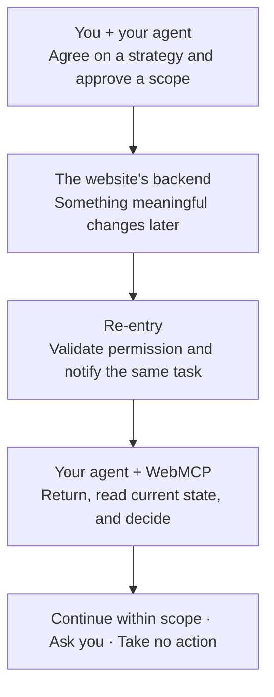

# Re-entry

### The web moves on. Your agent should too.

From one-off prompts to ongoing collaboration between people, agents, and the web.

[**Watch the demo · 2:24**](https://youtu.be/lovFAAftKeU) · [**Judge guide · Start here**](https://game.sleepless-kingdom.com/OpenAI-WebMCP-Challenge-Judge-Guide)

> **Judges: we strongly recommend starting with the [Judge Guide](https://game.sleepless-kingdom.com/OpenAI-WebMCP-Challenge-Judge-Guide).**
> It introduces the Sleepless Kingdom experience, the intended Agent journey, and the boundaries to look for.

## Real work does not end when the conversation does

An approval arrives tomorrow. A collaborator updates a document. A game world changes while
you are away.

WebMCP gives an agent structured tools on a live website. But being able to act while the agent
is there is only part of the story. What brings it back when something important happens later?

If you still have to notice every update, reopen the website, and tell your agent to continue,
you remain the link holding the workflow together.

**Re-entry explores a different relationship: the website can signal when it is time to return,
and your agent can pick up the work with you.**

## One scoped approval. A relationship that can continue.

Re-entry is an experimental continuation layer for WebMCP-powered websites. Its core design connects
a meaningful backend event to the user's existing agent task, then brings the agent back to the
live website to reassess.

The relationship is ongoing, not unlimited. Repeated eligible events can reuse the same approval
while it remains valid. Closing a page or going offline does not, by itself, revoke it.
Users retain control over the approved scope and can revoke future notifications.

The event explains **why the agent should look again**. It does not dictate what the agent must do.
The agent uses the prior conversation, your strategy, and the website's current state to decide.

## What makes this more than another notification?

- **The same task, not a fresh start.** Preserve the relationship with the agent you already briefed,
  rather than create an unrelated conversation for every event.
- **Permission for continuity, not permission for anything.** A standing approval covers defined
  future notifications. It does not override website permissions or authorize every possible action.
- **Fresh evidence before action.** The agent returns to the authenticated page and discovers the
  WebMCP tools valid now. An old event payload is not a substitute for current business truth.
- **Shared work, with human control.** People and agents work through the same web application.
  A useful next step might be a bounded action, a question for you, or a deliberate decision to do nothing.

We are not claiming to invent webhooks, queues, or agent resumption. The innovation is how these
pieces work together: **a user-approved return to the same task, grounded in a live WebMCP page.**
Re-entry delivers the notification; it does not supervise the agent until a business action happens.

## Our vision: make returning a native agent capability

**A website should be able to say: "When this approved event happens, bring my user's agent back."**

We want this pattern to work across mainstream agents through supported, permission-aware
continuation interfaces. The user should be able to keep their chosen agent; a website should not
have to build a separate embedded copilot to collaborate with it.

We would welcome the opportunity to work with **OpenAI** to explore making this capability native
to Codex and the wider agent ecosystem. With native support, the platform could own consent-aware
notification routing and task continuation, removing the need for a separately operated Re-entry
Cloud Receiver and Local Connector for that integration. Websites would still own their business
state, rules, and access controls.

This is a future direction, not an announced partnership or an available OpenAI feature. Re-entry
is an independent challenge project.

## A living world makes the idea tangible

Our first host application is **[Sleepless Kingdom](https://game.sleepless-kingdom.com)**:
a strategy game whose world keeps moving after the player leaves.

The demonstration story follows a gatherer:

1. You and your agent establish a strategy and authorize the relevant future notification.
2. A soldier goes out to collect resources. The world continues while you are away.
3. A later monster encounter destroys the soldier's unbanked cargo, creating a meaningful backend event.
4. In the intended Re-entry loop, the same agent task is notified and returns to inspect the live
   shelter, mission, and event history.
5. The agent considers a permitted recall, asks for your decision, or leaves things unchanged.
   Consequential choices remain with the player.

The game is the demonstration, not the limit of the idea. **The reusable concept is collaboration
that survives the wait.**

[**Explore the Judge Guide →**](https://game.sleepless-kingdom.com/OpenAI-WebMCP-Challenge-Judge-Guide)

## Why this could matter beyond games

The commercial opportunity is in workflows that span time, people, and changing information:
approvals, customer-service cases, collaborative projects, and operations.

| Who benefits | The value we aim to create |
| --- | --- |
| People using agents | Less checking, re-explaining, and manually restarting work after every update. |
| Web businesses and developers | Turn meaningful backend changes into timely follow-up through the user's own agent, while keeping existing business rules authoritative. |
| Agent platforms | Support longer-lived workflows that return to the user's real applications, context, and permissions. |

These are potential benefits, not measured ROI or validated market demand. Our ambition is to
shift the unit of interaction from **one prompt and one response** to **an ongoing, user-governed workflow**.

## The idea behind the components

Each part has a narrow role in the design:

| Component | Its purpose |
| --- | --- |
| **Manifest** | Declare the website's proposed return conditions, scope, and canonical destination. |
| **Host SDK** | Help an application express that offer and send signed events from its backend. |
| **Cloud Receiver** | Check consent and event authority, then route the approved notification. |
| **Local Connector** | Bridge delivery to the user's privately bound existing agent task. |
| **WebMCP** | Give the returning agent current page context and structured, application-governed tools. |

The website owns what is true. The user owns the permission and strategy. The agent decides what
to do next. Re-entry connects those responsibilities across time.

## Prototype today. A larger possibility ahead.

The prototype combines implemented Core, SDK, Receiver, and Connector components with Sleepless Kingdom.
Local protocol tests and bounded Codex/WebMCP experiments validate parts of the design.
The complete, repeatable hosted Game → Receiver → Connector → same-task WebMCP journey remains
an integration milestone, not a production-readiness claim.

For the precise implementation and proof boundaries, see
[Current Status](Docs/Core/00-current-status.md) and [Validation & Evidence](Docs/Core/05-validation-and-evidence.md).
The [documentation map](Docs/README.md) is available for deeper technical review.

---

Original project code and documentation are available under the [MIT License](LICENSE).
See [third-party notices](THIRD_PARTY_NOTICES.md) for reference material and external rights.
