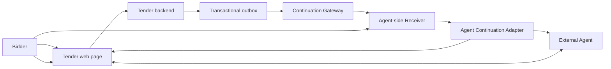

# TenderRelay System Design

**Role:** CANONICAL system architecture and contracts  
**Status:** Architecture baseline under the ADR-0001 planning premise  
**Last updated:** 2026-08-30

## 1. System objective

Carry a narrowly authorized business transition across time and back into the same governed
human–Agent web workflow without treating an event payload as application truth or unlimited
Agent authority.

## 2. Architectural invariants

1. The tender backend is authoritative for workflow state.
2. A continuation event is a signed notification, not an instruction prompt.
3. The user grants authority to an Agent-side component, not directly to the portal.
4. The portal stores only an opaque workflow-scoped binding.
5. Every resumed run must re-enter an allowlisted canonical origin and URL.
6. Current page state and current Site Tools determine valid next actions.
7. Tool mutations validate workflow state and artifact revision at execution time.
8. Consequential submission remains outside autonomous Agent authority.
9. Delivery, run, tool, and approval records share correlation identifiers.
10. Duplicate delivery cannot create duplicate runs or mutations.

## 3. Four architectural planes

| Plane | Responsibility | Authoritative component |
|---|---|---|
| **Business state** | Tender stage, clarification, draft revision, approval status | Tender application backend |
| **Page execution** | Human UI, stage-derived Site Tools, fresh-state validation | Tender web application |
| **Continuation control** | Grant binding, event verification, durable delivery, Agent resume | Continuation Gateway and Agent-side Receiver |
| **Governance** | Scope, expiry, revocation, approval, audit visibility | User and organization policy |

## 4. Component model



### Tender web page

- renders authoritative workflow state for the user;
- registers stage-specific WebMCP Site Tools;
- exposes the re-entry offer in plain language;
- displays draft revisions, re-entry reason, approval boundary, and receipts.

### Tender backend

- owns workflow and artifact state transitions;
- validates authorization and optimistic concurrency;
- writes event intents to a transactional outbox in the same transaction as state changes;
- never sends platform credentials or arbitrary Agent prompts.

### Continuation Gateway

- resolves opaque grant handles;
- verifies origin, workflow, event type, signature, time window, sequence, and replay state;
- durably records accepted or rejected delivery;
- hands accepted events to the Agent-side Receiver.

### Agent-side Receiver

- owns Continuation Grant records and the mapping to Agent context;
- enforces expiry, revocation, run, and concurrency limits;
- asks the Agent Continuation Adapter to resume the intended workflow;
- records run status without exposing raw context identifiers to the portal.

### Agent Continuation Adapter

An abstraction over the selected Agent platform. Under the current planning premise it must
provide the following observable contract:

1. bind a user-approved grant to a managed Agent context;
2. resume that context from a validated event;
3. obtain an eligible WebMCP-capable browser context;
4. open the allowlisted canonical URL;
5. wait for current page tools to register;
6. allow the Agent to invoke those tools;
7. return run, tool, and failure events to the Receiver.

The concrete platform route is not selected in this document. Choosing one requires an ADR
and passing the bridge protocol in `05-validation-and-evidence.md`.

## 5. Trust boundaries

```text
Portal origin and backend
    | signed manifest and typed event
    v
Continuation Gateway
    | validated event and opaque binding
    v
User-controlled Receiver and grant store
    | managed context binding
    v
Agent platform and browser
    | current authenticated page session
    v
Stage-specific WebMCP Site Tools
```

No boundary inherits authority merely because the previous boundary authenticated. The
Gateway verifies event authenticity; the Receiver verifies grant authority; the portal
revalidates user identity, workflow state, and action permissions.

## 6. End-to-end lifecycle

### Phase A — Initial live session

1. The user opens the tender page in a WebMCP-capable browser.
2. The page registers tools for the current stage.
3. The Agent reads tender state and prepares a visible initial draft.
4. The page presents a Re-entry Manifest for one future event.
5. The Receiver verifies the manifest and shows a user-controlled permission surface.
6. The user approves scope, expiry, run count, and approval boundary.
7. The Receiver creates a Continuation Grant and binds it to the current managed Agent context.
8. The portal receives only an opaque `agent_binding` and stores it with the tender workflow.

### Phase B — Waiting

9. The user may leave the page and the Agent turn may end.
10. The grant remains active, inspectable, and revocable; no work runs without an event.

### Phase C — Business transition and delivery

11. A reviewer creates a clarification request.
12. The tender backend commits the new state and an outbox record atomically.
13. An outbox relay sends a signed `clarification.requested` event.
14. The Gateway verifies and deduplicates the event before durable acceptance.
15. The Receiver resolves the grant and reserves one run atomically.

### Phase D — Agent re-entry

16. The adapter resumes the bound Agent context.
17. The browser opens the canonical tender URL.
18. The portal authenticates the user and renders current state.
19. The Agent reads current stage and state version through a Site Tool.
20. The page exposes clarification-stage tools.
21. The Agent prepares a visible clarification draft against the current revision.
22. The Agent stops at the human approval boundary.
23. The user edits, rejects, or approves; the portal records a receipt.

## 7. Core contracts

The following shapes are logical contracts. Exact serialization and transport remain
implementation decisions.

### 7.1 Re-entry Manifest

```json
{
  "manifest_version": "1",
  "manifest_id": "rm_...",
  "issuer_origin": "https://portal.example",
  "workflow": {
    "type": "tender",
    "id": "T-102",
    "state": "response-draft",
    "state_version": 12,
    "canonical_url": "https://portal.example/tenders/T-102"
  },
  "reentry_points": [
    {
      "event_type": "clarification.requested",
      "purpose": "Return to prepare a clarification response",
      "required_human_boundary": "approve-submission"
    }
  ],
  "requested_limits": {
    "expires_at": "...",
    "max_runs": 1,
    "max_concurrent_runs": 1
  },
  "issued_at": "...",
  "key_id": "...",
  "signature": "..."
}
```

Descriptions and predicted tool names are informative. They cannot grant backend
authorization or guarantee which tools will exist after re-entry.

### 7.2 Continuation Grant

```json
{
  "grant_id": "cg_...",
  "agent_binding": "ab_opaque_...",
  "subject": "user-or-organization-subject",
  "issuer_origin": "https://portal.example",
  "workflow_type": "tender",
  "workflow_id": "T-102",
  "canonical_url": "https://portal.example/tenders/T-102",
  "allowed_events": ["clarification.requested"],
  "approval_boundary": "approve-submission",
  "expires_at": "...",
  "max_runs": 1,
  "runs_reserved": 0,
  "status": "active"
}
```

The Receiver stores the platform-specific context binding separately from the grant exposed
to the portal.

### 7.3 Continuation Event

```json
{
  "event_version": "1",
  "event_id": "ce_...",
  "event_type": "clarification.requested",
  "issuer_origin": "https://portal.example",
  "agent_binding": "ab_opaque_...",
  "workflow_type": "tender",
  "workflow_id": "T-102",
  "state_version": 13,
  "event_sequence": 1,
  "occurred_at": "...",
  "canonical_url": "https://portal.example/tenders/T-102",
  "data": {
    "clarification_id": "CL-1"
  }
}
```

The signature is detached from the JSON body. The event contains bounded identifiers and
state metadata, not Agent instructions or full tender content.

### 7.4 Re-entry Run

```json
{
  "run_id": "rr_...",
  "grant_id": "cg_...",
  "event_id": "ce_...",
  "correlation_id": "tr_...",
  "status": "queued",
  "expected_origin": "https://portal.example",
  "expected_workflow_id": "T-102",
  "observed_state_version": null,
  "started_at": null,
  "completed_at": null,
  "failure_code": null
}
```

## 8. State models

### Tender workflow

```text
response-draft
  -> submitted
  -> clarification-requested
  -> clarification-draft
  -> clarification-approved
  -> clarification-submitted
```

The MVP may simulate the initial submission transition, but the clarification request must
be an authoritative backend state change.

### Grant

```text
pending -> active -> expired
                  -> revoked
                  -> exhausted
```

### Event delivery

```text
created -> dispatched -> accepted -> queued -> delivered
                     \-> rejected
                     \-> dead-lettered
```

### Re-entry run

```text
queued -> resuming -> opening-page -> verifying-state -> preparing-draft
      -> awaiting-human -> completed
      -> failed-retryable
      -> failed-terminal
      -> cancelled
```

## 9. Page tool surface

The page derives its tools from authoritative workflow state. The challenge MVP uses a
small portfolio:

| Stage | Tool | Effect |
|---|---|---|
| Initial response | `get_tender_context` | Read current tender, requirements, stage, and revisions |
| Initial response | `prepare_bid_draft` | Create or update a visible response draft |
| Initial response | `request_reentry_setup` | Return the current re-entry offer for user-controlled enrollment |
| Clarification | `get_clarification_context` | Read current clarification and relevant draft state |
| Clarification | `prepare_clarification_draft` | Create or update a visible clarification draft |

Final approval and submission remain human UI actions in the MVP.

## 10. Persistence and atomicity

The state transition and event intent must commit in one database transaction. A relay may
then deliver the outbox record at least once. The Gateway and Receiver must make repeated
delivery safe through unique event IDs, event sequence checks, atomic run reservation, and
idempotent draft operations.

Do not model an external queue write inside a database transaction as atomic. The MVP may
use a database-backed queue or transactional outbox to avoid unnecessary distributed state.

## 11. Implementation decisions still required

- concrete Agent Continuation Adapter and supported client;
- application framework, datastore, and hosting provider;
- manifest signing and key distribution for the MVP;
- organization identity and grant subject model;
- browser authentication recovery behavior;
- exact event delivery transport;
- retention duration for grants, events, run traces, and draft history.

Each decision must preserve the invariants in this document and be recorded before it
creates a cross-layer contract.
